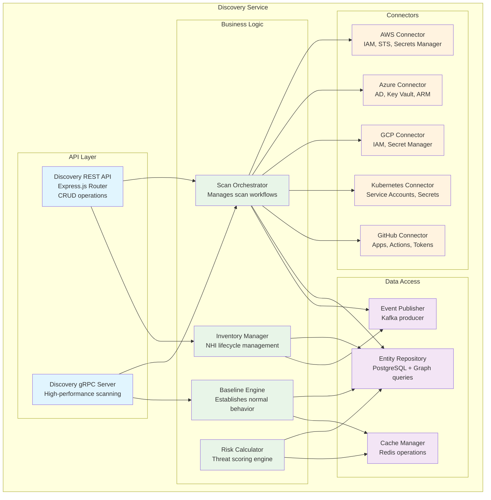
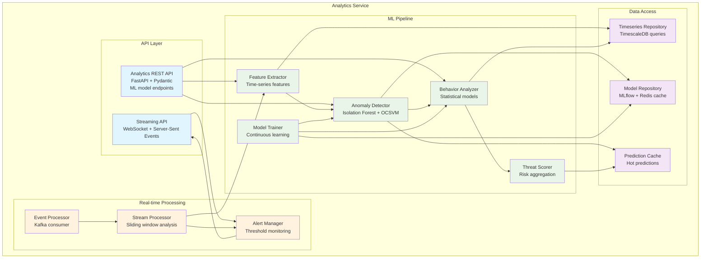
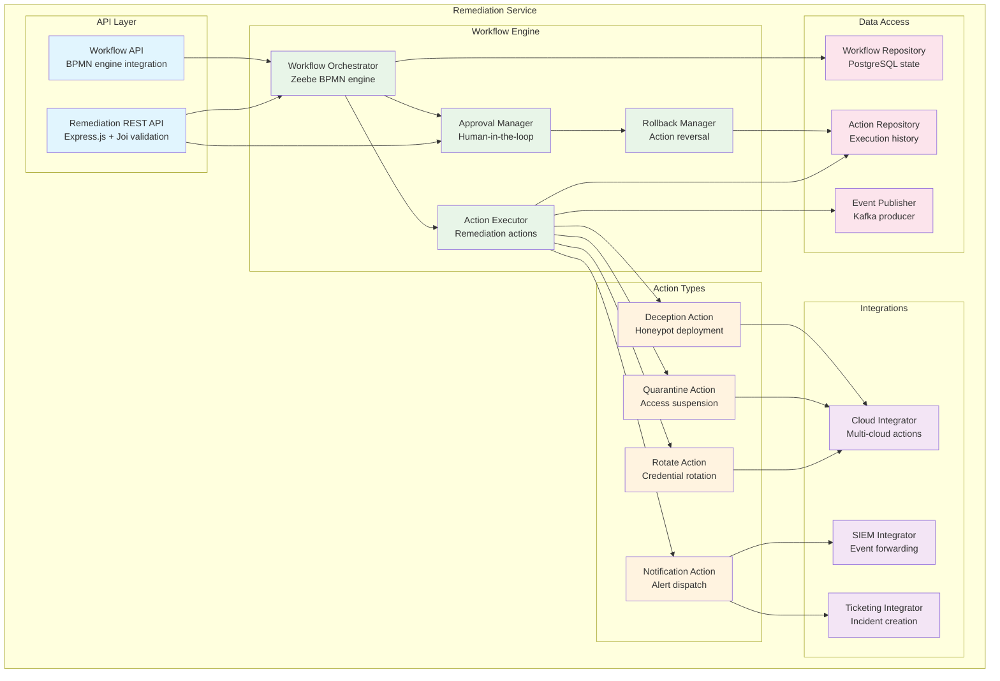

# C4 Model - Component Diagram
## Core Services Component Architecture

### Discovery Service Components

### Analytics Service Components

### Remediation Service Components

### Component Design Principles

#### Separation of Concerns
- **API Layer**: Request validation, authentication, response formatting
- **Business Logic**: Core domain logic, business rules, orchestration
- **Data Access**: Repository pattern, caching, event publishing
- **External Integrations**: Adapter pattern for third-party systems

#### Dependency Injection
- Constructor injection for testability
- Interface-based abstractions
- Configuration-driven implementations
- Mock-friendly for unit testing

#### Error Handling
- Structured error responses
- Circuit breaker patterns
- Retry mechanisms with exponential backoff
- Dead letter queues for failed operations

#### Performance Optimization
- Connection pooling for databases
- Async/await for I/O operations
- Caching at multiple layers
- Batch processing for bulk operations

#### Security Integration
- Input validation at API boundaries
- Authorization checks in business logic
- Secure credential handling
- Audit logging for all operations

### Technology Choices by Component

#### Discovery Service (Go)
- **Rationale**: High-performance concurrent scanning, strong typing
- **Frameworks**: Gin (HTTP), gRPC-Go, GORM (ORM)
- **Libraries**: AWS SDK, Azure SDK, GCP SDK, Kubernetes client-go

#### Analytics Service (Python)
- **Rationale**: Rich ML ecosystem, scientific computing libraries
- **Frameworks**: FastAPI, Pydantic, SQLAlchemy
- **Libraries**: scikit-learn, pandas, numpy, MLflow

#### Remediation Service (Node.js)
- **Rationale**: Event-driven architecture, JSON handling, rapid development
- **Frameworks**: Express.js, Joi validation, Zeebe Node.js client
- **Libraries**: AWS SDK, Azure SDK, node-cron, bull queue
