# C4 Model - Container Diagram
## Nexora Platform Containers

### Container Architecture

```mermaid
graph TB
    subgraph "Client Applications"
        WebApp[Web Application<br/>React 18 + TypeScript<br/>Port: 3000]
        MobileApp[Mobile App<br/>React Native<br/>iOS/Android]
        CLI[CLI Tool<br/>Go Binary<br/>nexora-cli]
    end
    
    subgraph "API Layer"
        APIGateway[API Gateway<br/>Kong Enterprise<br/>Port: 8080<br/>Rate Limiting, mTLS, JWT]
        GraphQL[GraphQL Gateway<br/>Apollo Federation<br/>Port: 4000]
    end
    
    subgraph "Core Services"
        AuthService[Authentication Service<br/>Node.js + Express<br/>Port: 3001<br/>JWT, OAuth2, SAML]
        
        DiscoveryService[Discovery Service<br/>Go + gRPC<br/>Port: 9001<br/>NHI Scanning & Inventory]
        
        AnalyticsService[Analytics Service<br/>Python + FastAPI<br/>Port: 8001<br/>ML Models, Anomaly Detection]
        
        RemediationService[Remediation Service<br/>Node.js + Express<br/>Port: 3002<br/>Workflow Engine]
        
        ThreatIntelService[Threat Intel Service<br/>Go + gRPC<br/>Port: 9002<br/>STIX/TAXII, IOC Processing]
        
        AuditService[Audit Service<br/>Go + gRPC<br/>Port: 9003<br/>Immutable Logs, Compliance]
    end
    
    subgraph "Data Layer"
        PostgresMain[PostgreSQL 15<br/>Primary Database<br/>Port: 5432<br/>Multi-tenant with RLS]
        
        TimescaleDB[TimescaleDB<br/>Time-series Events<br/>Port: 5433<br/>High-volume ingestion]
        
        GraphDB[pg_graph Extension<br/>Entity Relationships<br/>Graph queries]
        
        RedisCluster[Redis Cluster<br/>Caching & Sessions<br/>Port: 6379<br/>Hot data, ML predictions]
    end
    
    subgraph "Messaging & Events"
        Kafka[Apache Kafka<br/>Event Streaming<br/>Port: 9092<br/>Topics: nhi.*, threat.*, remediation.*]
        
        SchemaRegistry[Schema Registry<br/>Avro Schemas<br/>Port: 8081<br/>Event versioning]
    end
    
    subgraph "Security & Secrets"
        Vault[HashiCorp Vault<br/>Secrets Management<br/>Port: 8200<br/>Dynamic secrets, PKI]
        
        SPIRE[SPIFFE/SPIRE<br/>Service Identity<br/>Port: 8443<br/>mTLS certificates]
    end
    
    subgraph "Observability"
        Prometheus[Prometheus<br/>Metrics Collection<br/>Port: 9090]
        
        Grafana[Grafana<br/>Dashboards<br/>Port: 3000]
        
        Jaeger[Jaeger<br/>Distributed Tracing<br/>Port: 16686]
        
        Loki[Loki<br/>Log Aggregation<br/>Port: 3100]
    end
    
    %% Client to API connections
    WebApp --> APIGateway
    MobileApp --> APIGateway
    CLI --> APIGateway
    
    %% API Gateway routing
    APIGateway --> AuthService
    APIGateway --> GraphQL
    GraphQL --> DiscoveryService
    GraphQL --> AnalyticsService
    GraphQL --> RemediationService
    GraphQL --> ThreatIntelService
    GraphQL --> AuditService
    
    %% Service to database connections
    AuthService --> PostgresMain
    DiscoveryService --> PostgresMain
    DiscoveryService --> TimescaleDB
    AnalyticsService --> TimescaleDB
    AnalyticsService --> RedisCluster
    RemediationService --> PostgresMain
    ThreatIntelService --> PostgresMain
    AuditService --> TimescaleDB
    
    %% Graph relationships
    DiscoveryService --> GraphDB
    AnalyticsService --> GraphDB
    
    %% Event streaming
    DiscoveryService --> Kafka
    AnalyticsService --> Kafka
    RemediationService --> Kafka
    ThreatIntelService --> Kafka
    AuditService --> Kafka
    
    %% Schema management
    Kafka --> SchemaRegistry
    
    %% Security integrations
    AuthService --> Vault
    DiscoveryService --> Vault
    RemediationService --> Vault
    ThreatIntelService --> Vault
    
    %% Service mesh identity
    AuthService --> SPIRE
    DiscoveryService --> SPIRE
    AnalyticsService --> SPIRE
    RemediationService --> SPIRE
    ThreatIntelService --> SPIRE
    AuditService --> SPIRE
    
    %% Observability connections
    AuthService --> Prometheus
    DiscoveryService --> Prometheus
    AnalyticsService --> Prometheus
    RemediationService --> Prometheus
    ThreatIntelService --> Prometheus
    AuditService --> Prometheus
    
    Prometheus --> Grafana
    
    AuthService --> Jaeger
    DiscoveryService --> Jaeger
    AnalyticsService --> Jaeger
    RemediationService --> Jaeger
    ThreatIntelService --> Jaeger
    AuditService --> Jaeger
    
    classDef clientClass fill:#e1f5fe
    classDef apiClass fill:#f3e5f5
    classDef serviceClass fill:#e8f5e8
    classDef dataClass fill:#fff3e0
    classDef messagingClass fill:#fce4ec
    classDef securityClass fill:#f1f8e9
    classDef observabilityClass fill:#e0f2f1
    
    class WebApp,MobileApp,CLI clientClass
    class APIGateway,GraphQL apiClass
    class AuthService,DiscoveryService,AnalyticsService,RemediationService,ThreatIntelService,AuditService serviceClass
    class PostgresMain,TimescaleDB,GraphDB,RedisCluster dataClass
    class Kafka,SchemaRegistry messagingClass
    class Vault,SPIRE securityClass
    class Prometheus,Grafana,Jaeger,Loki observabilityClass
```

### Container Responsibilities

#### Client Applications
- **Web Application**: Primary SaaS interface for security teams
- **Mobile App**: Mobile access for incident response and monitoring
- **CLI Tool**: Automation and integration for DevOps workflows

#### API Layer
- **API Gateway**: Authentication, rate limiting, request routing, mTLS termination
- **GraphQL Gateway**: Federated schema, query optimization, real-time subscriptions

#### Core Services
- **Authentication Service**: User management, SSO, multi-factor authentication
- **Discovery Service**: NHI scanning, inventory management, baseline establishment
- **Analytics Service**: ML models, anomaly detection, behavioral analysis
- **Remediation Service**: Automated response workflows, approval processes
- **Threat Intel Service**: IOC processing, STIX/TAXII integration, threat correlation
- **Audit Service**: Immutable logging, compliance reporting, evidence collection

#### Data Layer
- **PostgreSQL**: Primary OLTP database with multi-tenant RLS
- **TimescaleDB**: High-volume time-series data for events and metrics
- **pg_graph**: Entity relationship modeling and graph queries
- **Redis Cluster**: Session storage, caching, ML prediction cache

#### Messaging & Events
- **Apache Kafka**: Event streaming backbone for real-time processing
- **Schema Registry**: Event schema management and evolution

#### Security & Secrets
- **HashiCorp Vault**: Dynamic secrets, PKI, encryption keys
- **SPIFFE/SPIRE**: Service identity and mTLS certificate management

#### Observability
- **Prometheus**: Metrics collection and alerting
- **Grafana**: Dashboards and visualization
- **Jaeger**: Distributed tracing and performance monitoring
- **Loki**: Log aggregation and search

### Deployment Characteristics
- **Containerized**: All services run in Docker containers
- **Kubernetes Native**: Deployed on EKS/GKE with Helm charts
- **Auto-scaling**: Horizontal Pod Autoscaler based on metrics
- **Health Checks**: Liveness and readiness probes for all services
- **Circuit Breakers**: Resilience patterns for service communication
- **Blue-Green Deployments**: Zero-downtime updates
