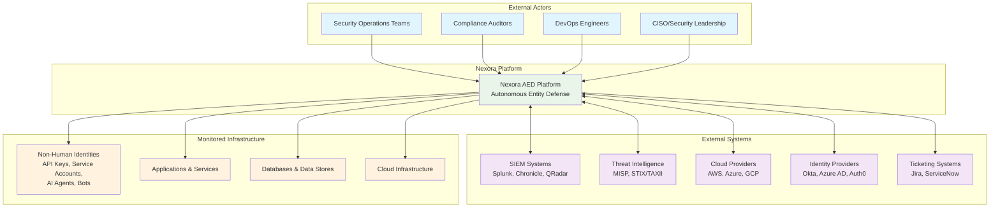

# C4 Model - Context Diagram
## Nexora Autonomous Entity Defense Platform

### System Context

### Context Description

#### Primary Users
- **Security Operations Teams**: Monitor threats, investigate incidents, manage remediation
- **Compliance Auditors**: Review audit trails, generate compliance reports
- **DevOps Engineers**: Configure integrations, manage NHI lifecycle
- **CISO/Security Leadership**: Strategic oversight, risk assessment, policy management

#### External Systems Integration
- **SIEM Systems**: Bi-directional event sharing, correlation, and enrichment
- **Threat Intelligence**: Consume IOCs, TTPs, and share threat data via STIX/TAXII
- **Cloud Providers**: Monitor resources, manage identities, execute remediation
- **Identity Providers**: Federated authentication, user provisioning, SSO
- **Ticketing Systems**: Automated incident creation, workflow integration

#### Monitored Entities
- **Non-Human Identities**: API keys, service accounts, machine identities, AI agents
- **Applications & Services**: Microservices, APIs, web applications, mobile apps
- **Databases & Data Stores**: SQL/NoSQL databases, data lakes, caches
- **Cloud Infrastructure**: Compute, storage, networking, serverless functions

### Key Capabilities
1. **Real-time NHI Discovery**: Continuous scanning and inventory management
2. **Behavioral Analytics**: ML-based anomaly detection and risk scoring
3. **Autonomous Remediation**: Automated response with human approval workflows
4. **Threat Intelligence**: Global threat sharing and correlation
5. **Compliance Reporting**: Immutable audit trails and regulatory compliance
6. **Zero Trust Architecture**: Continuous verification and least privilege access
