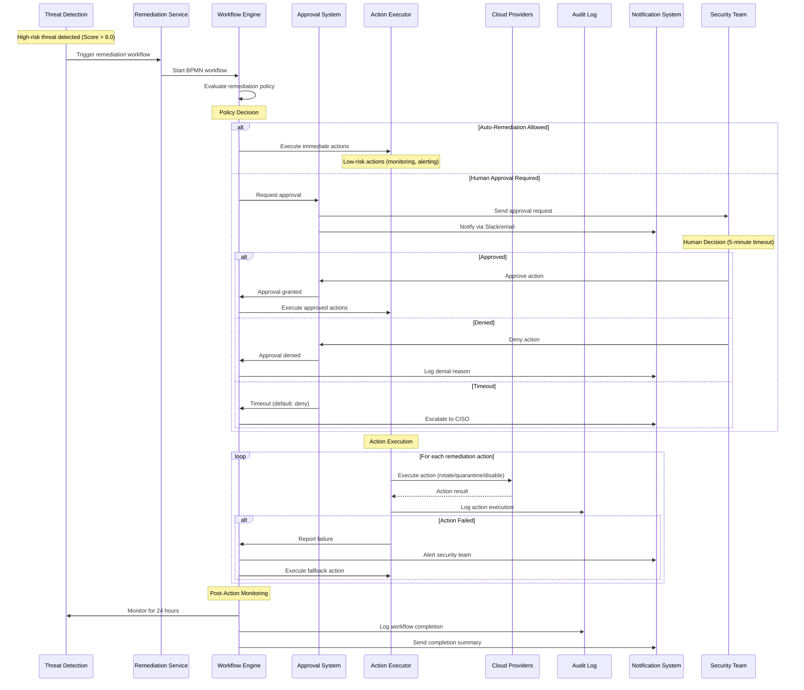
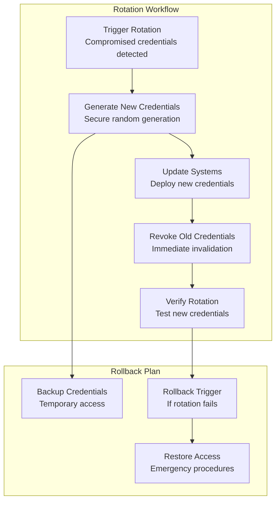
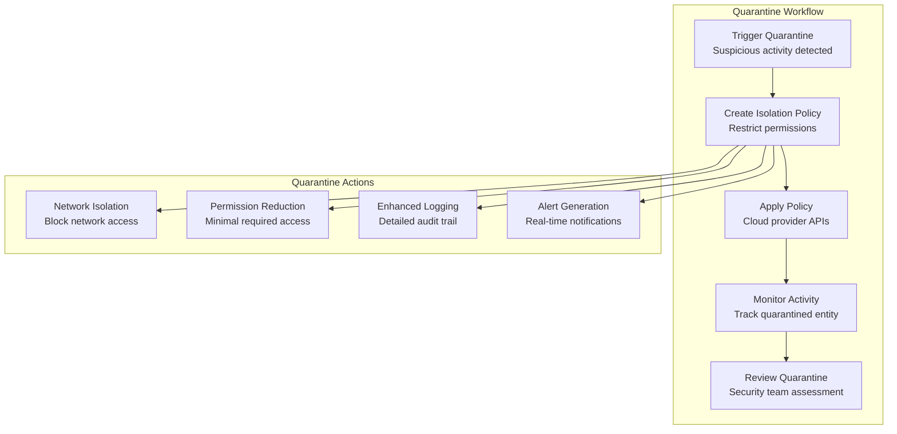
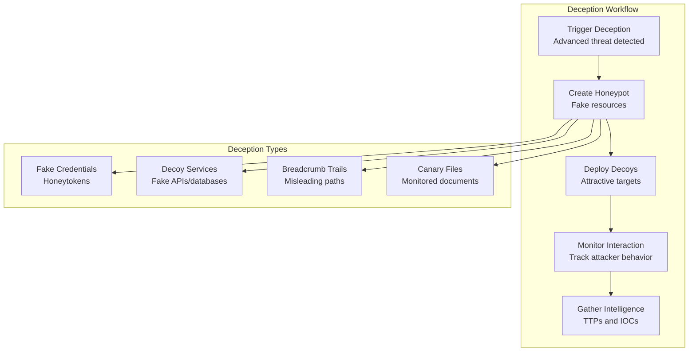

# Data Flow - Autonomous Remediation Workflow
## Automated Response with Human-in-the-Loop Controls

### Overview
The Autonomous Remediation Workflow provides automated threat response capabilities with configurable human approval gates. The system can execute remediation actions within seconds while maintaining strict controls for high-impact operations.

### Remediation Workflow Flow


### Remediation Action Types

#### 1. Credential Rotation


#### 2. Access Quarantine


#### 3. Deception Deployment


### Workflow Engine Configuration

#### BPMN Workflow Definition
```xml
<?xml version="1.0" encoding="UTF-8"?>
<bpmn:definitions xmlns:bpmn="http://www.omg.org/spec/BPMN/20100524/MODEL">
  <bpmn:process id="threat-remediation" name="Threat Remediation Workflow">
    
    <!-- Start Event -->
    <bpmn:startEvent id="threat-detected" name="Threat Detected">
      <bpmn:outgoing>evaluate-threat</bpmn:outgoing>
    </bpmn:startEvent>
    
    <!-- Threat Evaluation -->
    <bpmn:serviceTask id="evaluate-threat" name="Evaluate Threat Severity">
      <bpmn:incoming>threat-detected</bpmn:incoming>
      <bpmn:outgoing>threat-decision</bpmn:outgoing>
    </bpmn:serviceTask>
    
    <!-- Decision Gateway -->
    <bpmn:exclusiveGateway id="threat-decision" name="Remediation Decision">
      <bpmn:incoming>evaluate-threat</bpmn:incoming>
      <bpmn:outgoing>auto-remediate</bpmn:outgoing>
      <bpmn:outgoing>require-approval</bpmn:outgoing>
      <bpmn:outgoing>monitor-only</bpmn:outgoing>
    </bpmn:exclusiveGateway>
    
    <!-- Auto Remediation Path -->
    <bpmn:serviceTask id="auto-remediate" name="Execute Auto Remediation">
      <bpmn:incoming>auto-remediate</bpmn:incoming>
      <bpmn:outgoing>post-action-monitoring</bpmn:outgoing>
    </bpmn:serviceTask>
    
    <!-- Approval Required Path -->
    <bpmn:userTask id="require-approval" name="Human Approval Required">
      <bpmn:incoming>require-approval</bpmn:incoming>
      <bpmn:outgoing>approval-decision</bpmn:outgoing>
    </bpmn:userTask>
    
    <!-- Approval Gateway -->
    <bpmn:exclusiveGateway id="approval-decision" name="Approval Decision">
      <bpmn:incoming>require-approval</bpmn:incoming>
      <bpmn:outgoing>execute-approved</bpmn:outgoing>
      <bpmn:outgoing>escalate-denial</bpmn:outgoing>
    </bpmn:exclusiveGateway>
    
    <!-- Execute Approved Actions -->
    <bpmn:serviceTask id="execute-approved" name="Execute Approved Actions">
      <bpmn:incoming>execute-approved</bpmn:incoming>
      <bpmn:outgoing>post-action-monitoring</bpmn:outgoing>
    </bpmn:serviceTask>
    
    <!-- Post-Action Monitoring -->
    <bpmn:serviceTask id="post-action-monitoring" name="Post-Action Monitoring">
      <bpmn:incoming>auto-remediate</bpmn:incoming>
      <bpmn:incoming>execute-approved</bpmn:incoming>
      <bpmn:incoming>monitor-only</bpmn:incoming>
      <bpmn:outgoing>workflow-complete</bpmn:outgoing>
    </bpmn:serviceTask>
    
    <!-- End Event -->
    <bpmn:endEvent id="workflow-complete" name="Workflow Complete">
      <bpmn:incoming>post-action-monitoring</bpmn:incoming>
      <bpmn:incoming>escalate-denial</bpmn:incoming>
    </bpmn:endEvent>
    
  </bpmn:process>
</bpmn:definitions>
```

#### Remediation Policy Configuration
```yaml
remediation_policies:
  auto_remediation:
    enabled: true
    conditions:
      - threat_score: "< 6.0"
      - entity_risk: "LOW"
      - business_hours: true
    allowed_actions:
      - "monitor_enhanced"
      - "alert_security_team"
      - "temporary_permission_reduction"
    
  approval_required:
    enabled: true
    conditions:
      - threat_score: ">= 6.0 AND < 9.0"
      - entity_risk: "MEDIUM OR HIGH"
    approval_timeout: "5 minutes"
    allowed_actions:
      - "credential_rotation"
      - "access_quarantine"
      - "network_isolation"
    
  emergency_response:
    enabled: true
    conditions:
      - threat_score: ">= 9.0"
      - entity_risk: "CRITICAL"
    immediate_actions:
      - "disable_entity"
      - "revoke_all_access"
      - "alert_ciso"
    post_approval_actions:
      - "forensic_analysis"
      - "incident_response"

approval_matrix:
  low_impact:
    approvers: ["security_analyst"]
    required_approvals: 1
  
  medium_impact:
    approvers: ["security_manager", "senior_analyst"]
    required_approvals: 1
  
  high_impact:
    approvers: ["ciso", "security_manager"]
    required_approvals: 2
  
  critical_impact:
    approvers: ["ciso", "cto"]
    required_approvals: 2
    escalation_timeout: "2 minutes"
```

### Action Execution Framework

#### Action Executor Interface
```typescript
interface RemediationAction {
  id: string;
  type: ActionType;
  priority: Priority;
  estimatedDuration: number;
  rollbackPlan: RollbackPlan;
  
  execute(context: ExecutionContext): Promise<ActionResult>;
  validate(context: ExecutionContext): Promise<ValidationResult>;
  rollback(context: ExecutionContext): Promise<RollbackResult>;
}

enum ActionType {
  CREDENTIAL_ROTATION = "credential_rotation",
  ACCESS_QUARANTINE = "access_quarantine", 
  NETWORK_ISOLATION = "network_isolation",
  PERMISSION_REDUCTION = "permission_reduction",
  DECEPTION_DEPLOYMENT = "deception_deployment",
  NOTIFICATION = "notification"
}

enum Priority {
  IMMEDIATE = "immediate",     // < 30 seconds
  HIGH = "high",              // < 2 minutes
  MEDIUM = "medium",          // < 10 minutes
  LOW = "low"                 // < 1 hour
}
```

#### Credential Rotation Implementation
```typescript
class CredentialRotationAction implements RemediationAction {
  async execute(context: ExecutionContext): Promise<ActionResult> {
    const { entity, cloudProvider } = context;
    
    try {
      // 1. Generate new credentials
      const newCredentials = await this.generateCredentials(entity);
      
      // 2. Update systems with new credentials
      await this.updateSystems(entity, newCredentials);
      
      // 3. Verify new credentials work
      await this.verifyCredentials(entity, newCredentials);
      
      // 4. Revoke old credentials
      await this.revokeOldCredentials(entity);
      
      // 5. Log successful rotation
      await this.auditLog.log({
        action: "credential_rotation",
        entity_id: entity.id,
        status: "success",
        new_credential_id: newCredentials.id
      });
      
      return {
        status: "success",
        message: "Credentials rotated successfully",
        new_credential_id: newCredentials.id
      };
      
    } catch (error) {
      // Execute rollback plan
      await this.rollback(context);
      
      return {
        status: "failed",
        message: error.message,
        rollback_executed: true
      };
    }
  }
  
  async rollback(context: ExecutionContext): Promise<RollbackResult> {
    // Restore previous credentials if rotation failed
    const { entity } = context;
    
    try {
      await this.restoreBackupCredentials(entity);
      return { status: "success", message: "Rollback completed" };
    } catch (error) {
      return { status: "failed", message: error.message };
    }
  }
}
```

### Event Schema

#### Remediation Trigger Event
```json
{
  "event_type": "remediation.triggered",
  "timestamp": "2024-01-15T14:25:00.000Z",
  "tenant_id": "tenant_123",
  "workflow_id": "workflow_789",
  "trigger": {
    "threat_id": "threat_456",
    "threat_score": 8.7,
    "entity_id": "entity_123",
    "recommended_actions": [
      "credential_rotation",
      "access_quarantine"
    ]
  },
  "policy_decision": {
    "auto_remediation": false,
    "approval_required": true,
    "approval_level": "high_impact",
    "timeout_minutes": 5
  }
}
```

#### Action Execution Event
```json
{
  "event_type": "remediation.action_executed",
  "timestamp": "2024-01-15T14:27:30.000Z",
  "tenant_id": "tenant_123",
  "workflow_id": "workflow_789",
  "action": {
    "id": "action_321",
    "type": "credential_rotation",
    "status": "success",
    "duration_ms": 2500,
    "affected_systems": [
      "aws_iam_role_arn:aws:iam::123456789012:role/lambda-role",
      "application_config_service"
    ]
  },
  "approval": {
    "required": true,
    "approved_by": "security_manager_john",
    "approved_at": "2024-01-15T14:26:45.000Z",
    "approval_duration_ms": 45000
  },
  "rollback_plan": {
    "available": true,
    "estimated_duration_ms": 1000,
    "rollback_actions": ["restore_backup_credentials"]
  }
}
```

### Performance Characteristics

#### Response Time Targets
```yaml
Response Times:
  Threat Detection to Remediation Trigger: < 1 second
  Auto-Remediation Execution: < 30 seconds
  Approval Request Generation: < 5 seconds
  Human Approval Processing: < 5 minutes (timeout)
  Action Execution: 
    - Credential Rotation: < 2 minutes
    - Access Quarantine: < 30 seconds
    - Network Isolation: < 10 seconds
    - Deception Deployment: < 5 minutes

Scalability:
  Concurrent Workflows: 1000+
  Actions per Minute: 500+
  Approval Requests per Hour: 100+
  Rollback Success Rate: > 99%
```

#### Reliability and Recovery
```yaml
Reliability:
  Workflow Persistence: PostgreSQL with WAL
  Action Idempotency: All actions are idempotent
  Failure Recovery: Automatic retry with exponential backoff
  Circuit Breaker: Prevent cascade failures
  
Recovery Procedures:
  Failed Actions: Automatic rollback within 30 seconds
  Workflow Failures: Manual intervention with full audit trail
  System Outages: Graceful degradation to manual processes
  Data Consistency: ACID transactions for critical operations
```
