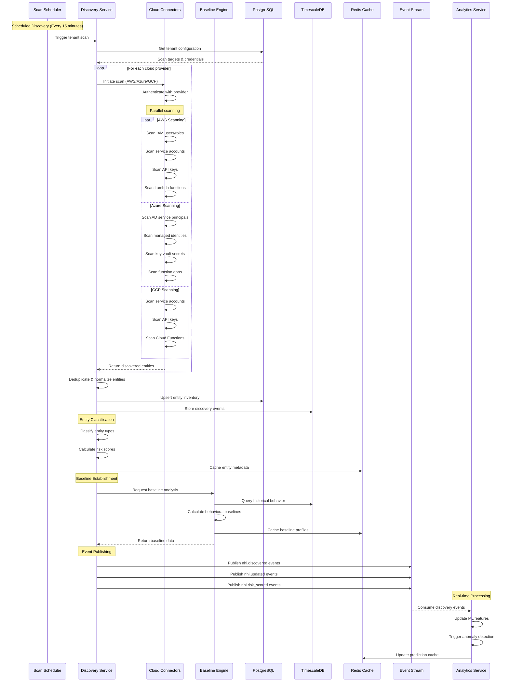
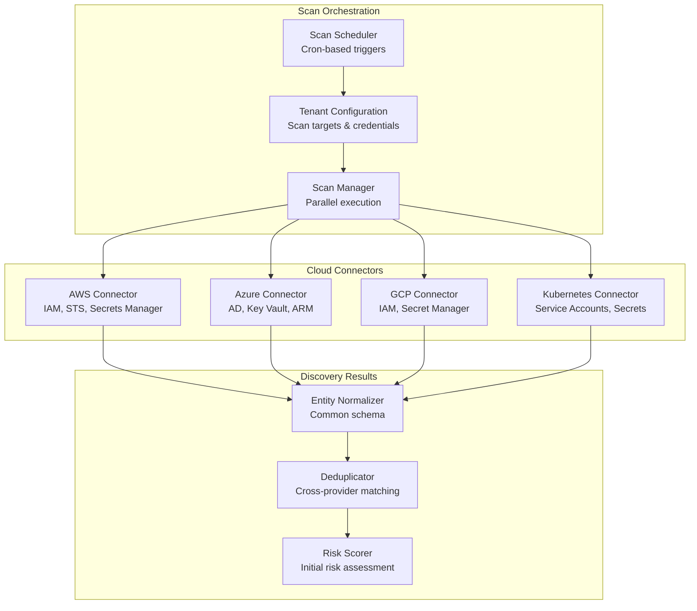
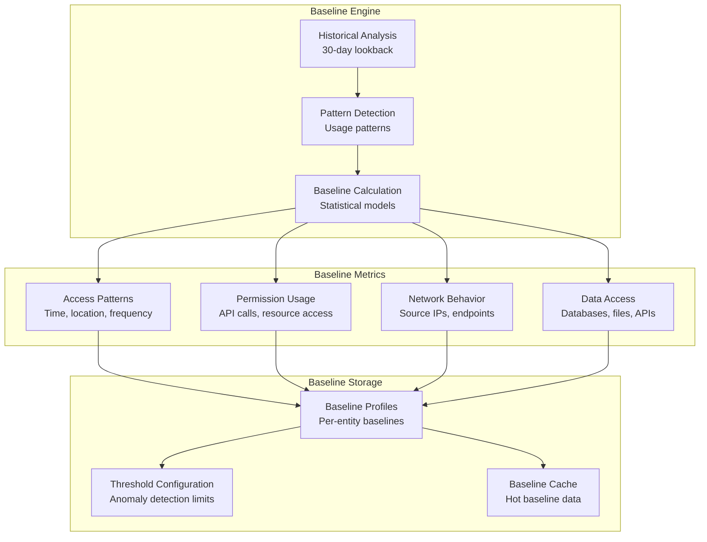

# Data Flow - NHI Discovery Pipeline
## Non-Human Identity Discovery and Inventory Management

### Overview
The NHI Discovery Pipeline continuously scans cloud environments, applications, and services to identify, catalog, and monitor non-human identities including API keys, service accounts, machine identities, and AI agents.

### Discovery Pipeline Flow


### Entity Discovery Process

#### 1. Scan Orchestration


#### 2. Entity Classification
```yaml
Entity Types:
  API_KEY:
    - REST API keys
    - GraphQL tokens
    - Third-party service keys
    
  SERVICE_ACCOUNT:
    - Cloud service accounts (AWS IAM roles, Azure managed identities)
    - Kubernetes service accounts
    - Database service users
    
  MACHINE_IDENTITY:
    - X.509 certificates
    - SSH keys
    - Kerberos principals
    
  AI_AGENT:
    - LLM API tokens
    - Autonomous agents
    - Chatbot credentials
    
  BOT_ACCOUNT:
    - CI/CD pipeline tokens
    - Monitoring service accounts
    - Automation scripts

Risk Factors:
  HIGH_RISK:
    - Admin privileges
    - Cross-account access
    - No rotation policy
    - Unused for >90 days
    
  MEDIUM_RISK:
    - Limited scope access
    - Infrequent usage
    - Shared credentials
    
  LOW_RISK:
    - Read-only access
    - Regular rotation
    - Scoped permissions
```

### Baseline Establishment

#### Behavioral Baseline Calculation


### Event Schema

#### Discovery Events
```json
{
  "event_type": "nhi.discovered",
  "timestamp": "2024-01-15T10:30:00Z",
  "tenant_id": "tenant_123",
  "entity": {
    "id": "entity_456",
    "type": "SERVICE_ACCOUNT",
    "provider": "AWS",
    "name": "lambda-execution-role",
    "arn": "arn:aws:iam::123456789012:role/lambda-execution-role",
    "created_at": "2024-01-10T08:00:00Z",
    "last_used": "2024-01-15T09:45:00Z",
    "permissions": [
      "logs:CreateLogGroup",
      "logs:CreateLogStream",
      "logs:PutLogEvents"
    ],
    "risk_score": 3.2,
    "risk_factors": ["unused_permissions", "broad_scope"]
  },
  "discovery_metadata": {
    "scan_id": "scan_789",
    "connector": "aws-iam",
    "discovery_method": "api_scan"
  }
}
```

#### Baseline Events
```json
{
  "event_type": "nhi.baseline_established",
  "timestamp": "2024-01-15T10:35:00Z",
  "tenant_id": "tenant_123",
  "entity_id": "entity_456",
  "baseline": {
    "access_pattern": {
      "typical_hours": [9, 10, 11, 14, 15, 16],
      "typical_days": ["monday", "tuesday", "wednesday", "thursday", "friday"],
      "frequency_per_hour": 12.5,
      "variance": 2.1
    },
    "network_behavior": {
      "typical_source_ips": ["10.0.1.100", "10.0.1.101"],
      "typical_regions": ["us-east-1"],
      "endpoint_patterns": ["/api/v1/data", "/api/v1/logs"]
    },
    "permission_usage": {
      "used_permissions": ["logs:CreateLogStream", "logs:PutLogEvents"],
      "unused_permissions": ["logs:CreateLogGroup"],
      "usage_frequency": {"logs:CreateLogStream": 0.8, "logs:PutLogEvents": 0.9}
    }
  }
}
```

### Performance Characteristics

#### Scalability Targets
- **Discovery Rate**: 10,000 entities/minute per connector
- **Concurrent Scans**: 50 parallel tenant scans
- **Event Throughput**: 100K events/second
- **Baseline Calculation**: <5 minutes for new entities

#### Optimization Strategies
- **Incremental Scanning**: Only scan changed resources
- **Caching**: Redis cache for entity metadata and baselines
- **Batch Processing**: Bulk database operations
- **Connection Pooling**: Reuse cloud provider connections
- **Rate Limiting**: Respect cloud provider API limits
