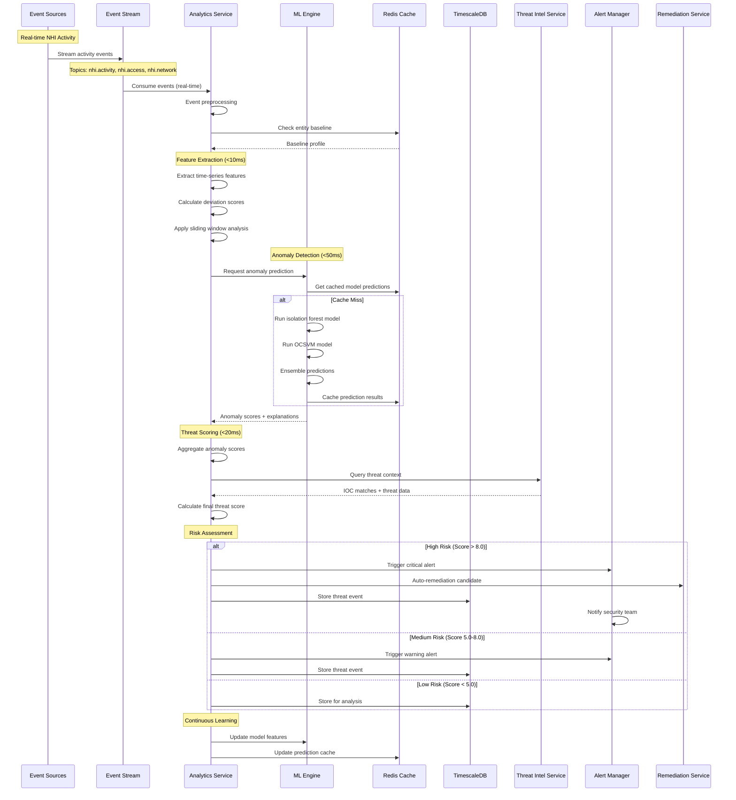
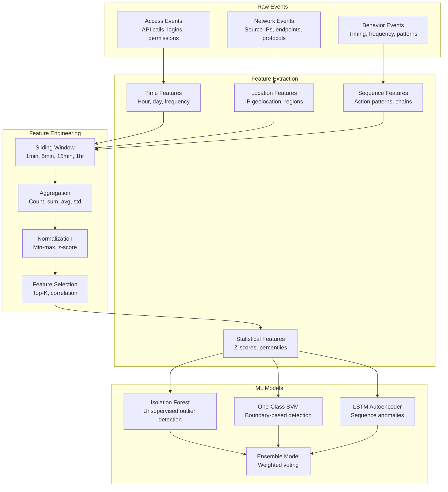
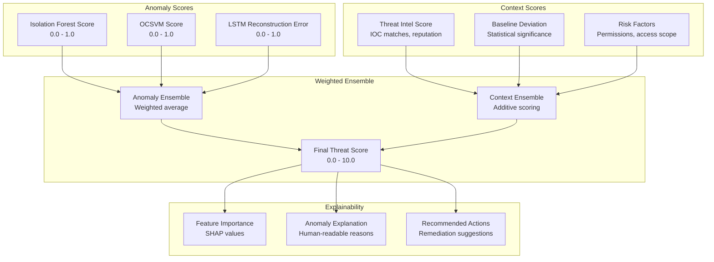

# Data Flow - Threat Detection & Scoring Pipeline
## Real-time Anomaly Detection and Threat Scoring

### Overview
The Threat Detection Pipeline processes real-time events from NHI activities, applies ML-based anomaly detection, and generates threat scores with explainable reasoning. The system maintains <100ms latency for critical threat detection while processing 100K+ events/second.

### Real-time Threat Detection Flow


### ML-Based Anomaly Detection Architecture

#### Feature Engineering Pipeline


#### Anomaly Detection Models

##### 1. Isolation Forest
```python
# Model Configuration
isolation_forest_config = {
    "n_estimators": 200,
    "max_samples": "auto",
    "contamination": 0.1,
    "max_features": 1.0,
    "bootstrap": False,
    "random_state": 42
}

# Features for Isolation Forest
features = [
    "access_frequency_1h",
    "unique_endpoints_1h", 
    "permission_scope_deviation",
    "time_of_day_zscore",
    "source_ip_entropy",
    "api_call_pattern_deviation"
]
```

##### 2. One-Class SVM
```python
# Model Configuration
ocsvm_config = {
    "kernel": "rbf",
    "gamma": "scale",
    "nu": 0.05,
    "degree": 3,
    "coef0": 0.0
}

# Features for OCSVM
features = [
    "network_behavior_score",
    "permission_usage_pattern",
    "temporal_access_pattern",
    "resource_access_deviation",
    "authentication_pattern_score"
]
```

##### 3. LSTM Autoencoder
```python
# Model Architecture
lstm_autoencoder = {
    "sequence_length": 60,  # 1 hour of minute-level data
    "features": 15,
    "encoder_layers": [64, 32, 16],
    "decoder_layers": [16, 32, 64],
    "dropout": 0.2,
    "reconstruction_threshold": 0.95
}

# Sequence Features
sequence_features = [
    "api_calls_per_minute",
    "data_volume_per_minute",
    "error_rate_per_minute",
    "response_time_per_minute",
    "unique_resources_per_minute"
]
```

### Threat Scoring Algorithm

#### Multi-factor Threat Score Calculation


#### Threat Score Calculation Formula
```python
def calculate_threat_score(anomaly_scores, context_scores, entity_metadata):
    """
    Calculate final threat score with explainability
    
    Returns: (score: float, explanation: dict)
    """
    
    # Anomaly ensemble (weighted average)
    anomaly_weights = {
        'isolation_forest': 0.4,
        'ocsvm': 0.3,
        'lstm_autoencoder': 0.3
    }
    
    anomaly_score = sum(
        anomaly_scores[model] * weight 
        for model, weight in anomaly_weights.items()
    )
    
    # Context scoring (additive)
    context_score = (
        context_scores['threat_intel'] * 2.0 +
        context_scores['baseline_deviation'] * 1.5 +
        context_scores['risk_factors'] * 1.0
    )
    
    # Entity risk multiplier
    risk_multiplier = {
        'HIGH_PRIVILEGE': 1.5,
        'CROSS_ACCOUNT': 1.3,
        'EXTERNAL_ACCESS': 1.2,
        'STANDARD': 1.0
    }.get(entity_metadata['risk_level'], 1.0)
    
    # Final score (0-10 scale)
    raw_score = (anomaly_score * 5.0) + context_score
    final_score = min(raw_score * risk_multiplier, 10.0)
    
    # Generate explanation
    explanation = generate_explanation(
        anomaly_scores, context_scores, 
        entity_metadata, final_score
    )
    
    return final_score, explanation
```

### Event Schema

#### Activity Events
```json
{
  "event_type": "nhi.activity",
  "timestamp": "2024-01-15T14:23:45.123Z",
  "tenant_id": "tenant_123",
  "entity_id": "entity_456",
  "activity": {
    "type": "api_call",
    "endpoint": "/api/v1/sensitive-data",
    "method": "GET",
    "response_code": 200,
    "response_time_ms": 245,
    "data_volume_bytes": 1048576,
    "source_ip": "203.0.113.42",
    "user_agent": "python-requests/2.28.1",
    "authentication_method": "api_key"
  },
  "context": {
    "geolocation": {
      "country": "US",
      "region": "California",
      "city": "San Francisco",
      "latitude": 37.7749,
      "longitude": -122.4194
    },
    "network": {
      "asn": "AS13335",
      "organization": "Cloudflare",
      "is_tor": false,
      "is_vpn": false
    }
  }
}
```

#### Threat Detection Results
```json
{
  "event_type": "threat.detected",
  "timestamp": "2024-01-15T14:23:46.789Z",
  "tenant_id": "tenant_123",
  "entity_id": "entity_456",
  "threat_score": 8.7,
  "risk_level": "HIGH",
  "anomaly_scores": {
    "isolation_forest": 0.92,
    "ocsvm": 0.85,
    "lstm_autoencoder": 0.78
  },
  "context_scores": {
    "threat_intel": 2.1,
    "baseline_deviation": 3.2,
    "risk_factors": 1.8
  },
  "explanation": {
    "primary_reasons": [
      "Unusual access time (3 std deviations from baseline)",
      "New source IP address not seen in 30 days",
      "Accessing sensitive endpoints outside normal pattern"
    ],
    "contributing_factors": [
      "High-privilege entity",
      "Cross-account access permissions",
      "No recent authentication"
    ],
    "feature_importance": {
      "time_of_day_zscore": 0.35,
      "source_ip_entropy": 0.28,
      "endpoint_sensitivity": 0.22,
      "access_frequency": 0.15
    }
  },
  "recommended_actions": [
    "Require re-authentication",
    "Temporarily restrict permissions",
    "Notify security team",
    "Monitor for 24 hours"
  ]
}
```

### Performance Optimization

#### Caching Strategy
```yaml
Cache Layers:
  L1_Cache: # Hot data (Redis)
    - Entity baselines (TTL: 1 hour)
    - ML model predictions (TTL: 5 minutes)
    - Threat intel IOCs (TTL: 15 minutes)
    
  L2_Cache: # Warm data (Redis)
    - Historical patterns (TTL: 24 hours)
    - Feature vectors (TTL: 6 hours)
    - Model artifacts (TTL: 7 days)
    
  L3_Cache: # Cold data (TimescaleDB)
    - Raw events (Retention: 7 years)
    - Aggregated metrics (Retention: 2 years)
    - Model training data (Retention: 1 year)

Cache Invalidation:
  - Baseline updates trigger cache refresh
  - Model retraining invalidates prediction cache
  - Threat intel updates trigger IOC cache refresh
```

#### Stream Processing Optimization
```yaml
Kafka Configuration:
  Partitions: 32 per topic
  Replication Factor: 3
  Batch Size: 16KB
  Linger MS: 5
  Compression: snappy
  
Consumer Configuration:
  Max Poll Records: 1000
  Fetch Min Bytes: 1KB
  Fetch Max Wait: 10ms
  Auto Commit: false
  
Processing Guarantees:
  - At-least-once delivery
  - Idempotent processing
  - Exactly-once semantics for critical paths
```
