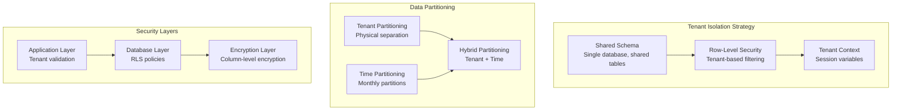

# Database Design - Multi-Tenant Schema
## PostgreSQL 15 with Row-Level Security (RLS) and TimescaleDB

### Overview
The Nexora platform uses a multi-tenant database architecture with strict data isolation using PostgreSQL's Row-Level Security (RLS). The design supports 1M+ NHI entities per customer with high-performance time-series data storage via TimescaleDB.

### Multi-Tenant Architecture Strategy

#### Tenant Isolation Model


### Core Database Schema

#### 1. Tenant Management
```sql
-- Tenants table
CREATE TABLE tenants (
    id UUID PRIMARY KEY DEFAULT gen_random_uuid(),
    name VARCHAR(255) NOT NULL,
    slug VARCHAR(100) UNIQUE NOT NULL,
    plan_type VARCHAR(50) NOT NULL DEFAULT 'standard',
    status VARCHAR(20) NOT NULL DEFAULT 'active',
    settings JSONB NOT NULL DEFAULT '{}',
    encryption_key_id VARCHAR(255),
    created_at TIMESTAMPTZ NOT NULL DEFAULT NOW(),
    updated_at TIMESTAMPTZ NOT NULL DEFAULT NOW(),
    
    CONSTRAINT valid_status CHECK (status IN ('active', 'suspended', 'deleted')),
    CONSTRAINT valid_plan CHECK (plan_type IN ('trial', 'standard', 'enterprise', 'custom'))
);

-- Tenant users and roles
CREATE TABLE tenant_users (
    id UUID PRIMARY KEY DEFAULT gen_random_uuid(),
    tenant_id UUID NOT NULL REFERENCES tenants(id) ON DELETE CASCADE,
    user_id UUID NOT NULL,
    email VARCHAR(255) NOT NULL,
    role VARCHAR(50) NOT NULL DEFAULT 'viewer',
    permissions JSONB NOT NULL DEFAULT '[]',
    status VARCHAR(20) NOT NULL DEFAULT 'active',
    last_login_at TIMESTAMPTZ,
    created_at TIMESTAMPTZ NOT NULL DEFAULT NOW(),
    
    CONSTRAINT valid_role CHECK (role IN ('admin', 'manager', 'analyst', 'viewer', 'auditor')),
    CONSTRAINT valid_user_status CHECK (status IN ('active', 'suspended', 'deleted')),
    UNIQUE(tenant_id, user_id)
);

-- Enable RLS on tenant tables
ALTER TABLE tenants ENABLE ROW LEVEL SECURITY;
ALTER TABLE tenant_users ENABLE ROW LEVEL SECURITY;

-- RLS policies for tenant isolation
CREATE POLICY tenant_isolation ON tenants
    USING (id = current_setting('app.current_tenant_id')::UUID);

CREATE POLICY tenant_user_isolation ON tenant_users
    USING (tenant_id = current_setting('app.current_tenant_id')::UUID);
```

#### 2. Entity Management
```sql
-- Non-Human Identities (NHI) entities
CREATE TABLE entities (
    id UUID PRIMARY KEY DEFAULT gen_random_uuid(),
    tenant_id UUID NOT NULL REFERENCES tenants(id) ON DELETE CASCADE,
    external_id VARCHAR(500) NOT NULL, -- Provider-specific ID
    name VARCHAR(255) NOT NULL,
    type VARCHAR(50) NOT NULL,
    provider VARCHAR(50) NOT NULL,
    provider_region VARCHAR(50),
    status VARCHAR(20) NOT NULL DEFAULT 'active',
    risk_score DECIMAL(3,1) NOT NULL DEFAULT 0.0,
    risk_level VARCHAR(20) NOT NULL DEFAULT 'low',
    
    -- Entity metadata
    metadata JSONB NOT NULL DEFAULT '{}',
    permissions JSONB NOT NULL DEFAULT '[]',
    tags JSONB NOT NULL DEFAULT '[]',
    
    -- Lifecycle tracking
    first_seen_at TIMESTAMPTZ NOT NULL DEFAULT NOW(),
    last_seen_at TIMESTAMPTZ NOT NULL DEFAULT NOW(),
    last_used_at TIMESTAMPTZ,
    created_at TIMESTAMPTZ NOT NULL DEFAULT NOW(),
    updated_at TIMESTAMPTZ NOT NULL DEFAULT NOW(),
    
    CONSTRAINT valid_entity_type CHECK (type IN (
        'api_key', 'service_account', 'machine_identity', 
        'ai_agent', 'bot_account', 'certificate', 'ssh_key'
    )),
    CONSTRAINT valid_provider CHECK (provider IN (
        'aws', 'azure', 'gcp', 'kubernetes', 'github', 
        'gitlab', 'docker', 'terraform', 'custom'
    )),
    CONSTRAINT valid_entity_status CHECK (status IN (
        'active', 'inactive', 'quarantined', 'disabled', 'deleted'
    )),
    CONSTRAINT valid_risk_level CHECK (risk_level IN (
        'low', 'medium', 'high', 'critical'
    )),
    CONSTRAINT valid_risk_score CHECK (risk_score >= 0.0 AND risk_score <= 10.0),
    
    UNIQUE(tenant_id, external_id, provider)
);

-- Entity relationships (graph structure)
CREATE TABLE entity_relationships (
    id UUID PRIMARY KEY DEFAULT gen_random_uuid(),
    tenant_id UUID NOT NULL REFERENCES tenants(id) ON DELETE CASCADE,
    source_entity_id UUID NOT NULL REFERENCES entities(id) ON DELETE CASCADE,
    target_entity_id UUID NOT NULL REFERENCES entities(id) ON DELETE CASCADE,
    relationship_type VARCHAR(50) NOT NULL,
    strength DECIMAL(3,2) NOT NULL DEFAULT 1.0,
    metadata JSONB NOT NULL DEFAULT '{}',
    created_at TIMESTAMPTZ NOT NULL DEFAULT NOW(),
    
    CONSTRAINT valid_relationship_type CHECK (relationship_type IN (
        'uses', 'manages', 'accesses', 'owns', 'delegates_to', 
        'inherits_from', 'similar_to', 'replaces'
    )),
    CONSTRAINT valid_strength CHECK (strength >= 0.0 AND strength <= 1.0),
    CONSTRAINT no_self_reference CHECK (source_entity_id != target_entity_id),
    
    UNIQUE(tenant_id, source_entity_id, target_entity_id, relationship_type)
);

-- Entity baselines for behavioral analysis
CREATE TABLE entity_baselines (
    id UUID PRIMARY KEY DEFAULT gen_random_uuid(),
    tenant_id UUID NOT NULL REFERENCES tenants(id) ON DELETE CASCADE,
    entity_id UUID NOT NULL REFERENCES entities(id) ON DELETE CASCADE,
    baseline_type VARCHAR(50) NOT NULL,
    baseline_data JSONB NOT NULL,
    confidence_score DECIMAL(3,2) NOT NULL DEFAULT 0.0,
    sample_size INTEGER NOT NULL DEFAULT 0,
    calculation_date TIMESTAMPTZ NOT NULL DEFAULT NOW(),
    expires_at TIMESTAMPTZ,
    
    CONSTRAINT valid_baseline_type CHECK (baseline_type IN (
        'access_pattern', 'network_behavior', 'permission_usage',
        'temporal_pattern', 'resource_access', 'api_usage'
    )),
    CONSTRAINT valid_confidence CHECK (confidence_score >= 0.0 AND confidence_score <= 1.0),
    
    UNIQUE(tenant_id, entity_id, baseline_type)
);

-- Enable RLS on entity tables
ALTER TABLE entities ENABLE ROW LEVEL SECURITY;
ALTER TABLE entity_relationships ENABLE ROW LEVEL SECURITY;
ALTER TABLE entity_baselines ENABLE ROW LEVEL SECURITY;

-- RLS policies for entity tables
CREATE POLICY entity_tenant_isolation ON entities
    USING (tenant_id = current_setting('app.current_tenant_id')::UUID);

CREATE POLICY relationship_tenant_isolation ON entity_relationships
    USING (tenant_id = current_setting('app.current_tenant_id')::UUID);

CREATE POLICY baseline_tenant_isolation ON entity_baselines
    USING (tenant_id = current_setting('app.current_tenant_id')::UUID);
```

#### 3. Time-Series Events (TimescaleDB)
```sql
-- Create TimescaleDB extension
CREATE EXTENSION IF NOT EXISTS timescaledb;

-- Entity activity events (high-volume time-series data)
CREATE TABLE entity_events (
    time TIMESTAMPTZ NOT NULL,
    tenant_id UUID NOT NULL,
    entity_id UUID NOT NULL,
    event_type VARCHAR(50) NOT NULL,
    event_subtype VARCHAR(50),
    source_ip INET,
    source_location JSONB,
    target_resource VARCHAR(500),
    event_data JSONB NOT NULL DEFAULT '{}',
    risk_score DECIMAL(3,1),
    anomaly_score DECIMAL(3,2),
    
    -- Performance optimization
    tenant_time TIMESTAMPTZ GENERATED ALWAYS AS (time) STORED
);

-- Convert to hypertable (TimescaleDB)
SELECT create_hypertable('entity_events', 'time', 
    partitioning_column => 'tenant_id',
    number_partitions => 32,
    chunk_time_interval => INTERVAL '1 day'
);

-- Threat detection events
CREATE TABLE threat_events (
    time TIMESTAMPTZ NOT NULL,
    tenant_id UUID NOT NULL,
    entity_id UUID NOT NULL,
    threat_id UUID NOT NULL DEFAULT gen_random_uuid(),
    threat_type VARCHAR(50) NOT NULL,
    threat_score DECIMAL(3,1) NOT NULL,
    confidence DECIMAL(3,2) NOT NULL,
    status VARCHAR(20) NOT NULL DEFAULT 'open',
    
    -- Detection details
    detection_method VARCHAR(50) NOT NULL,
    anomaly_details JSONB NOT NULL DEFAULT '{}',
    threat_indicators JSONB NOT NULL DEFAULT '[]',
    recommended_actions JSONB NOT NULL DEFAULT '[]',
    
    -- Resolution tracking
    resolved_at TIMESTAMPTZ,
    resolution_method VARCHAR(50),
    false_positive BOOLEAN DEFAULT FALSE,
    
    tenant_time TIMESTAMPTZ GENERATED ALWAYS AS (time) STORED
);

SELECT create_hypertable('threat_events', 'time',
    partitioning_column => 'tenant_id', 
    number_partitions => 32,
    chunk_time_interval => INTERVAL '1 hour'
);

-- Remediation action events
CREATE TABLE remediation_events (
    time TIMESTAMPTZ NOT NULL,
    tenant_id UUID NOT NULL,
    entity_id UUID NOT NULL,
    threat_id UUID,
    workflow_id UUID NOT NULL,
    action_id UUID NOT NULL DEFAULT gen_random_uuid(),
    action_type VARCHAR(50) NOT NULL,
    status VARCHAR(20) NOT NULL,
    
    -- Execution details
    triggered_by VARCHAR(100),
    approval_required BOOLEAN NOT NULL DEFAULT FALSE,
    approved_by VARCHAR(100),
    approved_at TIMESTAMPTZ,
    executed_at TIMESTAMPTZ,
    completed_at TIMESTAMPTZ,
    
    -- Results
    success BOOLEAN,
    error_message TEXT,
    rollback_executed BOOLEAN DEFAULT FALSE,
    impact_assessment JSONB,
    
    tenant_time TIMESTAMPTZ GENERATED ALWAYS AS (time) STORED
);

SELECT create_hypertable('remediation_events', 'time',
    partitioning_column => 'tenant_id',
    number_partitions => 32, 
    chunk_time_interval => INTERVAL '1 hour'
);

-- Enable RLS on time-series tables
ALTER TABLE entity_events ENABLE ROW LEVEL SECURITY;
ALTER TABLE threat_events ENABLE ROW LEVEL SECURITY;
ALTER TABLE remediation_events ENABLE ROW LEVEL SECURITY;

-- RLS policies for time-series tables
CREATE POLICY entity_events_tenant_isolation ON entity_events
    USING (tenant_id = current_setting('app.current_tenant_id')::UUID);

CREATE POLICY threat_events_tenant_isolation ON threat_events
    USING (tenant_id = current_setting('app.current_tenant_id')::UUID);

CREATE POLICY remediation_events_tenant_isolation ON remediation_events
    USING (tenant_id = current_setting('app.current_tenant_id')::UUID);
```

### Indexing Strategy

#### Performance Indexes
```sql
-- Entity table indexes
CREATE INDEX CONCURRENTLY idx_entities_tenant_type ON entities(tenant_id, type);
CREATE INDEX CONCURRENTLY idx_entities_tenant_provider ON entities(tenant_id, provider);
CREATE INDEX CONCURRENTLY idx_entities_risk_score ON entities(tenant_id, risk_score DESC);
CREATE INDEX CONCURRENTLY idx_entities_last_seen ON entities(tenant_id, last_seen_at DESC);
CREATE INDEX CONCURRENTLY idx_entities_metadata_gin ON entities USING GIN(metadata);

-- Entity relationships indexes
CREATE INDEX CONCURRENTLY idx_relationships_source ON entity_relationships(tenant_id, source_entity_id);
CREATE INDEX CONCURRENTLY idx_relationships_target ON entity_relationships(tenant_id, target_entity_id);
CREATE INDEX CONCURRENTLY idx_relationships_type ON entity_relationships(tenant_id, relationship_type);

-- Time-series indexes (TimescaleDB automatically creates time indexes)
CREATE INDEX CONCURRENTLY idx_entity_events_entity ON entity_events(tenant_id, entity_id, time DESC);
CREATE INDEX CONCURRENTLY idx_entity_events_type ON entity_events(tenant_id, event_type, time DESC);
CREATE INDEX CONCURRENTLY idx_entity_events_risk ON entity_events(tenant_id, risk_score DESC, time DESC);

CREATE INDEX CONCURRENTLY idx_threat_events_entity ON threat_events(tenant_id, entity_id, time DESC);
CREATE INDEX CONCURRENTLY idx_threat_events_score ON threat_events(tenant_id, threat_score DESC, time DESC);
CREATE INDEX CONCURRENTLY idx_threat_events_status ON threat_events(tenant_id, status, time DESC);

-- GIN indexes for JSONB columns
CREATE INDEX CONCURRENTLY idx_entity_events_data_gin ON entity_events USING GIN(event_data);
CREATE INDEX CONCURRENTLY idx_threat_events_indicators_gin ON threat_events USING GIN(threat_indicators);
```

### Data Retention Policies

#### Automated Data Lifecycle Management
```sql
-- Create retention policies for TimescaleDB
-- Keep detailed events for 90 days, aggregated data for 2 years, audit data for 7 years

-- Entity events retention (90 days detailed, then aggregate)
SELECT add_retention_policy('entity_events', INTERVAL '90 days');

-- Create continuous aggregates for long-term storage
CREATE MATERIALIZED VIEW entity_events_hourly
WITH (timescaledb.continuous) AS
SELECT 
    time_bucket('1 hour', time) AS hour,
    tenant_id,
    entity_id,
    event_type,
    COUNT(*) as event_count,
    AVG(risk_score) as avg_risk_score,
    MAX(risk_score) as max_risk_score,
    AVG(anomaly_score) as avg_anomaly_score
FROM entity_events
GROUP BY hour, tenant_id, entity_id, event_type;

-- Threat events retention (2 years)
SELECT add_retention_policy('threat_events', INTERVAL '2 years');

-- Remediation events retention (7 years for compliance)
SELECT add_retention_policy('remediation_events', INTERVAL '7 years');

-- Create audit log table for compliance (never deleted)
CREATE TABLE audit_logs (
    id UUID PRIMARY KEY DEFAULT gen_random_uuid(),
    time TIMESTAMPTZ NOT NULL DEFAULT NOW(),
    tenant_id UUID NOT NULL,
    user_id UUID,
    action VARCHAR(100) NOT NULL,
    resource_type VARCHAR(50) NOT NULL,
    resource_id VARCHAR(255) NOT NULL,
    details JSONB NOT NULL DEFAULT '{}',
    ip_address INET,
    user_agent TEXT,
    
    -- Cryptographic integrity
    hash_chain_previous VARCHAR(64),
    hash_chain_current VARCHAR(64) NOT NULL,
    
    tenant_time TIMESTAMPTZ GENERATED ALWAYS AS (time) STORED
);

SELECT create_hypertable('audit_logs', 'time',
    partitioning_column => 'tenant_id',
    number_partitions => 32,
    chunk_time_interval => INTERVAL '1 month'
);

-- Audit logs are never automatically deleted (compliance requirement)
ALTER TABLE audit_logs ENABLE ROW LEVEL SECURITY;
CREATE POLICY audit_logs_tenant_isolation ON audit_logs
    USING (tenant_id = current_setting('app.current_tenant_id')::UUID);
```

### Database Functions and Triggers

#### Tenant Context Management
```sql
-- Function to set tenant context
CREATE OR REPLACE FUNCTION set_tenant_context(tenant_uuid UUID)
RETURNS VOID AS $$
BEGIN
    PERFORM set_config('app.current_tenant_id', tenant_uuid::TEXT, TRUE);
END;
$$ LANGUAGE plpgsql SECURITY DEFINER;

-- Function to get current tenant
CREATE OR REPLACE FUNCTION get_current_tenant()
RETURNS UUID AS $$
BEGIN
    RETURN current_setting('app.current_tenant_id', TRUE)::UUID;
EXCEPTION
    WHEN OTHERS THEN
        RETURN NULL;
END;
$$ LANGUAGE plpgsql SECURITY DEFINER;

-- Trigger to automatically set tenant_id
CREATE OR REPLACE FUNCTION set_tenant_id()
RETURNS TRIGGER AS $$
BEGIN
    IF NEW.tenant_id IS NULL THEN
        NEW.tenant_id := get_current_tenant();
    END IF;
    RETURN NEW;
END;
$$ LANGUAGE plpgsql;

-- Apply trigger to relevant tables
CREATE TRIGGER set_tenant_id_trigger
    BEFORE INSERT ON entities
    FOR EACH ROW EXECUTE FUNCTION set_tenant_id();

CREATE TRIGGER set_tenant_id_trigger
    BEFORE INSERT ON entity_relationships  
    FOR EACH ROW EXECUTE FUNCTION set_tenant_id();
```

#### Audit Trail Functions
```sql
-- Function to create audit log entry with hash chain
CREATE OR REPLACE FUNCTION create_audit_log(
    p_action VARCHAR(100),
    p_resource_type VARCHAR(50), 
    p_resource_id VARCHAR(255),
    p_details JSONB DEFAULT '{}'
)
RETURNS UUID AS $$
DECLARE
    v_audit_id UUID;
    v_previous_hash VARCHAR(64);
    v_current_hash VARCHAR(64);
    v_tenant_id UUID;
BEGIN
    v_tenant_id := get_current_tenant();
    
    -- Get previous hash for chain integrity
    SELECT hash_chain_current INTO v_previous_hash
    FROM audit_logs 
    WHERE tenant_id = v_tenant_id
    ORDER BY time DESC 
    LIMIT 1;
    
    -- Generate new audit ID
    v_audit_id := gen_random_uuid();
    
    -- Calculate current hash (SHA-256 of previous hash + current data)
    v_current_hash := encode(
        digest(
            COALESCE(v_previous_hash, '') || 
            v_audit_id::TEXT || 
            p_action || 
            p_resource_type || 
            p_resource_id ||
            p_details::TEXT,
            'sha256'
        ),
        'hex'
    );
    
    -- Insert audit log
    INSERT INTO audit_logs (
        id, tenant_id, action, resource_type, resource_id, 
        details, hash_chain_previous, hash_chain_current
    ) VALUES (
        v_audit_id, v_tenant_id, p_action, p_resource_type, 
        p_resource_id, p_details, v_previous_hash, v_current_hash
    );
    
    RETURN v_audit_id;
END;
$$ LANGUAGE plpgsql SECURITY DEFINER;
```

### Performance Optimization

#### Connection Pooling Configuration
```yaml
# PgBouncer configuration for connection pooling
databases:
  nexora_production:
    host: postgres-primary.internal
    port: 5432
    dbname: nexora
    auth_user: pgbouncer
    pool_size: 50
    reserve_pool: 10
    max_client_conn: 1000

pool_mode: transaction
max_client_conn: 2000
default_pool_size: 25
max_db_connections: 100
max_user_connections: 100

# TimescaleDB specific optimizations
timescaledb:
  max_background_workers: 16
  timescaledb.max_background_workers: 8
  shared_preload_libraries: 'timescaledb,pg_stat_statements'
  
  # Chunk management
  chunk_time_interval: '1 day'
  chunk_target_size: '1GB'
  
  # Compression
  compression_enabled: true
  compression_segment_by: 'tenant_id'
  compression_order_by: 'time DESC'
```

#### Query Performance Monitoring
```sql
-- Create monitoring views for performance analysis
CREATE VIEW tenant_query_performance AS
SELECT 
    t.name as tenant_name,
    s.query,
    s.calls,
    s.total_time,
    s.mean_time,
    s.rows,
    s.shared_blks_hit,
    s.shared_blks_read
FROM pg_stat_statements s
JOIN pg_database d ON d.oid = s.dbid
JOIN tenants t ON t.id::TEXT = ANY(regexp_split_to_array(s.query, ''''))
WHERE d.datname = 'nexora'
ORDER BY s.total_time DESC;

-- Monitor RLS policy performance
CREATE VIEW rls_performance AS
SELECT 
    schemaname,
    tablename,
    n_tup_ins,
    n_tup_upd,
    n_tup_del,
    n_tup_hot_upd,
    seq_scan,
    seq_tup_read,
    idx_scan,
    idx_tup_fetch
FROM pg_stat_user_tables
WHERE schemaname = 'public'
ORDER BY seq_scan DESC;
```
