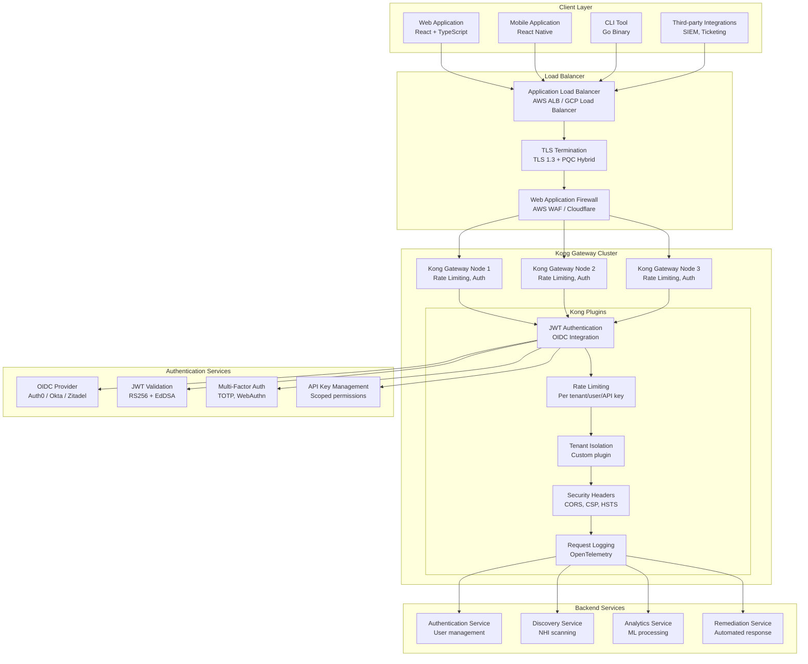
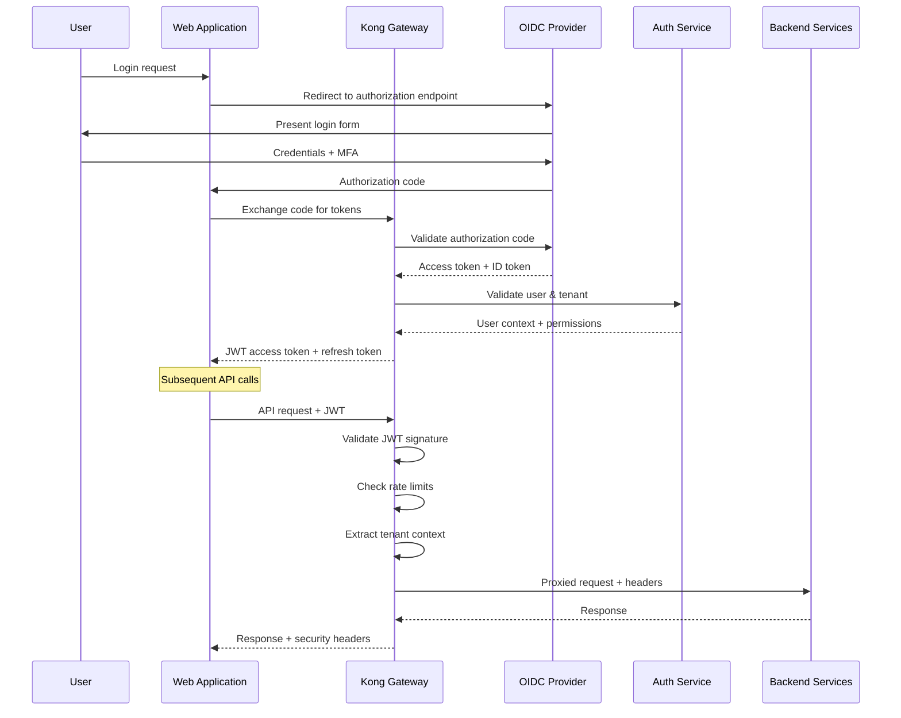
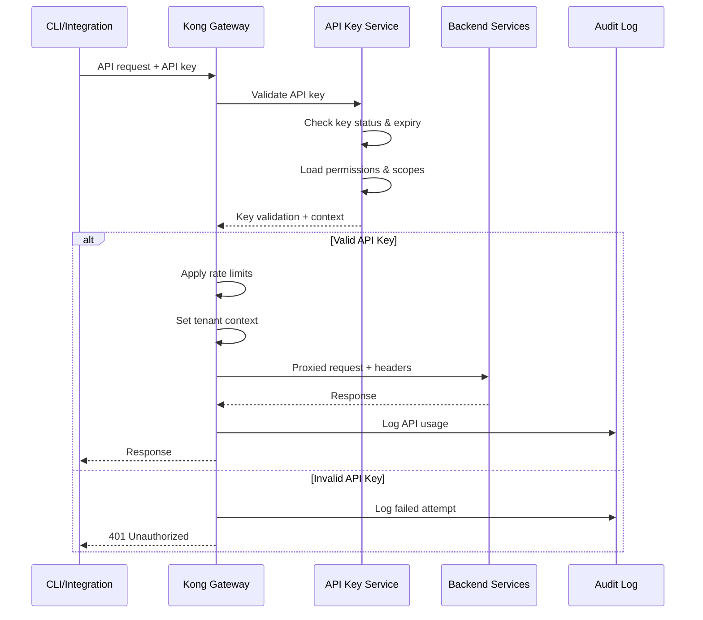
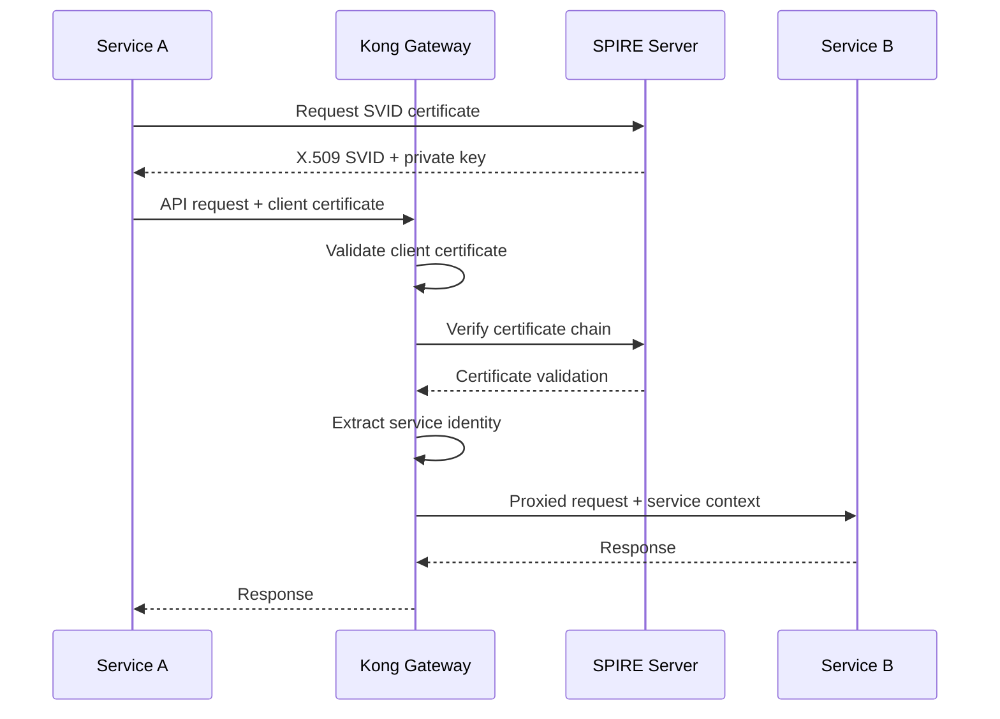

# API Gateway - Authentication & Authorization Architecture
## Kong Enterprise with Zero Trust Security

### Overview
The Nexora API Gateway provides a unified entry point with comprehensive authentication, authorization, rate limiting, and security controls. Built on Kong Enterprise with custom plugins for multi-tenant isolation and quantum-resistant cryptography integration points.

### API Gateway Architecture

#### Gateway Components


### Authentication Methods

#### 1. OIDC/OAuth2 Flow (Web/Mobile)


#### 2. API Key Authentication (CLI/Integrations)


#### 3. Service-to-Service mTLS


### Kong Gateway Configuration

#### Core Gateway Configuration
```yaml
# kong.yml - Declarative configuration
_format_version: "3.0"

services:
  - name: auth-service
    url: http://auth-service:3001
    plugins:
      - name: jwt
        config:
          secret_is_base64: false
          key_claim_name: iss
          claims_to_verify: [exp, iss, aud]
      - name: rate-limiting-advanced
        config:
          limit: [1000, 10000]
          window_size: [60, 3600]
          identifier: consumer
          sync_rate: 10
          strategy: redis
          redis_host: redis-cluster
          redis_port: 6379

  - name: discovery-service
    url: http://discovery-service:9001
    plugins:
      - name: jwt
      - name: tenant-isolation
        config:
          tenant_header: X-Tenant-ID
          enforce_isolation: true
      - name: rate-limiting-advanced
        config:
          limit: [500, 5000]
          window_size: [60, 3600]

  - name: analytics-service
    url: http://analytics-service:8001
    plugins:
      - name: jwt
      - name: tenant-isolation
      - name: rate-limiting-advanced
        config:
          limit: [2000, 20000]  # Higher limits for ML service
          window_size: [60, 3600]

routes:
  - name: auth-routes
    service: auth-service
    paths: ["/api/v1/auth"]
    methods: [GET, POST, PUT, DELETE]
    
  - name: discovery-routes
    service: discovery-service
    paths: ["/api/v1/entities", "/api/v1/scan"]
    methods: [GET, POST, PUT, DELETE]
    
  - name: analytics-routes
    service: analytics-service
    paths: ["/api/v1/analytics", "/api/v1/threats"]
    methods: [GET, POST]

consumers:
  - username: web-app
    jwt_secrets:
      - key: web-app-issuer
        algorithm: RS256
        rsa_public_key: |
          -----BEGIN PUBLIC KEY-----
          [RSA PUBLIC KEY]
          -----END PUBLIC KEY-----

plugins:
  - name: cors
    config:
      origins: ["https://app.nexora.com", "https://admin.nexora.com"]
      methods: [GET, POST, PUT, DELETE, OPTIONS]
      headers: [Accept, Authorization, Content-Type, X-Tenant-ID]
      credentials: true
      max_age: 3600

  - name: request-transformer
    config:
      add:
        headers: ["X-Request-ID:$(uuid)"]
        
  - name: response-transformer
    config:
      add:
        headers: 
          - "X-Content-Type-Options:nosniff"
          - "X-Frame-Options:DENY"
          - "X-XSS-Protection:1; mode=block"
          - "Strict-Transport-Security:max-age=31536000; includeSubDomains"
```

#### Custom Tenant Isolation Plugin
```lua
-- tenant-isolation plugin for Kong
local TenantIsolation = {}

TenantIsolation.PRIORITY = 1000
TenantIsolation.VERSION = "1.0.0"

local function extract_tenant_from_jwt(jwt_token)
  local jwt = require "resty.jwt"
  local jwt_obj = jwt:verify(kong.configuration.jwt_secret, jwt_token)
  
  if jwt_obj and jwt_obj.payload and jwt_obj.payload.tenant_id then
    return jwt_obj.payload.tenant_id
  end
  
  return nil
end

local function extract_tenant_from_api_key(api_key)
  -- Query API key service to get tenant context
  local http = require "resty.http"
  local httpc = http.new()
  
  local res, err = httpc:request_uri("http://auth-service:3001/api/v1/api-keys/" .. api_key .. "/tenant")
  
  if res and res.status == 200 then
    local cjson = require "cjson"
    local data = cjson.decode(res.body)
    return data.tenant_id
  end
  
  return nil
end

function TenantIsolation:access(conf)
  local tenant_id = nil
  
  -- Extract tenant from Authorization header
  local auth_header = kong.request.get_header("Authorization")
  if auth_header then
    if string.sub(auth_header, 1, 7) == "Bearer " then
      -- JWT token
      local jwt_token = string.sub(auth_header, 8)
      tenant_id = extract_tenant_from_jwt(jwt_token)
    elseif string.sub(auth_header, 1, 7) == "ApiKey " then
      -- API key
      local api_key = string.sub(auth_header, 8)
      tenant_id = extract_tenant_from_api_key(api_key)
    end
  end
  
  -- Also check X-API-Key header
  if not tenant_id then
    local api_key = kong.request.get_header("X-API-Key")
    if api_key then
      tenant_id = extract_tenant_from_api_key(api_key)
    end
  end
  
  if not tenant_id then
    return kong.response.exit(401, {message = "Invalid or missing tenant context"})
  end
  
  -- Set tenant context for downstream services
  kong.service.request.set_header("X-Tenant-ID", tenant_id)
  kong.service.request.set_header("X-Tenant-Isolation", "enforced")
  
  -- Log tenant access for audit
  kong.log.info("Tenant access: ", tenant_id, " Path: ", kong.request.get_path())
end

return TenantIsolation
```

### Rate Limiting Strategy

#### Multi-Dimensional Rate Limiting
```yaml
Rate Limiting Tiers:
  Free Tier:
    requests_per_minute: 100
    requests_per_hour: 1000
    requests_per_day: 10000
    burst_capacity: 50
    
  Standard Tier:
    requests_per_minute: 1000
    requests_per_hour: 10000
    requests_per_day: 100000
    burst_capacity: 500
    
  Enterprise Tier:
    requests_per_minute: 10000
    requests_per_hour: 100000
    requests_per_day: 1000000
    burst_capacity: 5000

Rate Limiting Dimensions:
  - Per Consumer (user/API key)
  - Per Tenant (organization)
  - Per IP Address (DDoS protection)
  - Per Endpoint (resource protection)
  - Per Service (backend protection)

Rate Limiting Algorithms:
  - Sliding Window: Precise rate limiting
  - Token Bucket: Burst handling
  - Fixed Window: Simple implementation
  - Distributed: Redis-based coordination
```

#### Rate Limiting Configuration
```yaml
# Kong rate limiting plugin configuration
rate_limiting_advanced:
  # Multiple limits with different windows
  limits:
    - limit: 100
      window_size: 60  # 100 requests per minute
      window_type: sliding
    - limit: 1000  
      window_size: 3600  # 1000 requests per hour
      window_type: sliding
    - limit: 10000
      window_size: 86400  # 10000 requests per day
      window_type: sliding
  
  # Identification strategy
  identifier: consumer  # Rate limit per authenticated user
  
  # Distributed coordination
  strategy: redis
  redis_host: redis-cluster.internal
  redis_port: 6379
  redis_database: 0
  redis_timeout: 2000
  
  # Response headers
  hide_client_headers: false
  header_name: X-RateLimit-Limit
  
  # Sync settings for distributed deployment
  sync_rate: 10  # Sync every 10 seconds
  
  # Error handling
  fault_tolerant: true  # Continue if Redis is down
  error_code: 429
  error_message: "Rate limit exceeded"
```

### Security Controls

#### Security Headers Configuration
```yaml
Security Headers:
  Content-Security-Policy: |
    default-src 'self';
    script-src 'self' 'unsafe-inline' https://cdn.jsdelivr.net;
    style-src 'self' 'unsafe-inline' https://fonts.googleapis.com;
    font-src 'self' https://fonts.gstatic.com;
    img-src 'self' data: https:;
    connect-src 'self' wss: https:;
    frame-ancestors 'none';
    base-uri 'self';
    form-action 'self';
    
  Strict-Transport-Security: "max-age=31536000; includeSubDomains; preload"
  X-Content-Type-Options: "nosniff"
  X-Frame-Options: "DENY"
  X-XSS-Protection: "1; mode=block"
  Referrer-Policy: "strict-origin-when-cross-origin"
  Permissions-Policy: |
    geolocation=(), microphone=(), camera=(), 
    payment=(), usb=(), magnetometer=(), gyroscope=()

CORS Configuration:
  allowed_origins:
    - "https://app.nexora.com"
    - "https://admin.nexora.com"
    - "https://api.nexora.com"
  allowed_methods: [GET, POST, PUT, DELETE, OPTIONS]
  allowed_headers: 
    - Authorization
    - Content-Type
    - X-Tenant-ID
    - X-API-Key
    - X-Request-ID
  expose_headers:
    - X-RateLimit-Limit
    - X-RateLimit-Remaining
    - X-Request-ID
  credentials: true
  max_age: 3600
```

#### API Key Management
```typescript
interface APIKey {
  id: string;
  name: string;
  key_hash: string;  // SHA-256 hash of actual key
  tenant_id: string;
  created_by: string;
  
  // Permissions and scoping
  scopes: string[];  // e.g., ["entities:read", "threats:read", "remediation:execute"]
  permissions: Permission[];
  ip_whitelist?: string[];
  
  // Lifecycle management
  status: 'active' | 'suspended' | 'revoked';
  expires_at?: Date;
  last_used_at?: Date;
  usage_count: number;
  
  // Rate limiting overrides
  rate_limit_override?: {
    requests_per_minute: number;
    requests_per_hour: number;
    requests_per_day: number;
  };
  
  created_at: Date;
  updated_at: Date;
}

interface Permission {
  resource: string;  // e.g., "entities", "threats", "remediation"
  actions: string[]; // e.g., ["read", "write", "delete"]
  conditions?: {
    tenant_id?: string;
    resource_type?: string[];
    risk_level?: string[];
  };
}

class APIKeyService {
  async generateAPIKey(request: CreateAPIKeyRequest): Promise<APIKey> {
    // Generate cryptographically secure API key
    const key = await this.generateSecureKey(32);
    const keyHash = await this.hashKey(key);
    
    const apiKey: APIKey = {
      id: uuidv4(),
      name: request.name,
      key_hash: keyHash,
      tenant_id: request.tenant_id,
      created_by: request.created_by,
      scopes: request.scopes,
      permissions: request.permissions,
      ip_whitelist: request.ip_whitelist,
      status: 'active',
      expires_at: request.expires_at,
      usage_count: 0,
      created_at: new Date(),
      updated_at: new Date()
    };
    
    await this.repository.save(apiKey);
    
    // Return the actual key only once
    return { ...apiKey, key };
  }
  
  async validateAPIKey(key: string): Promise<APIKeyValidation> {
    const keyHash = await this.hashKey(key);
    const apiKey = await this.repository.findByHash(keyHash);
    
    if (!apiKey || apiKey.status !== 'active') {
      return { valid: false, reason: 'Invalid or inactive API key' };
    }
    
    if (apiKey.expires_at && apiKey.expires_at < new Date()) {
      return { valid: false, reason: 'API key expired' };
    }
    
    // Update usage statistics
    await this.updateUsage(apiKey.id);
    
    return {
      valid: true,
      api_key: apiKey,
      tenant_id: apiKey.tenant_id,
      permissions: apiKey.permissions,
      scopes: apiKey.scopes
    };
  }
  
  private async generateSecureKey(length: number): Promise<string> {
    const bytes = crypto.randomBytes(length);
    return `nxr_${bytes.toString('base64url')}`;
  }
  
  private async hashKey(key: string): Promise<string> {
    return crypto.createHash('sha256').update(key).digest('hex');
  }
}
```

### Monitoring and Observability

#### Gateway Metrics
```yaml
Kong Metrics:
  # Request metrics
  - kong_http_requests_total
  - kong_http_request_duration_seconds
  - kong_http_request_size_bytes
  - kong_http_response_size_bytes
  
  # Rate limiting metrics
  - kong_rate_limit_exceeded_total
  - kong_rate_limit_remaining
  
  # Authentication metrics
  - kong_auth_attempts_total
  - kong_auth_failures_total
  - kong_jwt_validation_duration_seconds
  
  # Plugin metrics
  - kong_plugin_execution_duration_seconds
  - kong_plugin_errors_total
  
  # Upstream metrics
  - kong_upstream_health_checks_total
  - kong_upstream_response_time_seconds

Alerting Rules:
  - name: HighErrorRate
    expr: rate(kong_http_requests_total{status=~"5.."}[5m]) > 0.1
    for: 2m
    
  - name: AuthenticationFailures
    expr: rate(kong_auth_failures_total[5m]) > 10
    for: 1m
    
  - name: RateLimitExceeded
    expr: rate(kong_rate_limit_exceeded_total[5m]) > 100
    for: 5m
```

### Quantum-Resistant Cryptography Integration

#### PQC Hybrid TLS Configuration
```yaml
# Quantum-resistant cryptography preparation
TLS_Configuration:
  # Current production (TLS 1.3)
  cipher_suites:
    - TLS_AES_256_GCM_SHA384
    - TLS_CHACHA20_POLY1305_SHA256
    - TLS_AES_128_GCM_SHA256
  
  # Post-quantum hybrid (future)
  pqc_hybrid_suites:
    - TLS_KYBER768_AES_256_GCM_SHA384
    - TLS_DILITHIUM3_ECDSA_P256_SHA256
    - TLS_FALCON512_RSA_PSS_SHA256
  
  # Certificate chain
  certificate_chain:
    - leaf: RSA-4096 + Dilithium3 (hybrid)
    - intermediate: RSA-4096 + Falcon-1024
    - root: RSA-4096 (current) -> Kyber1024 (future)

JWT_Signing:
  # Current algorithms
  current:
    - RS256 (RSA-2048)
    - ES256 (ECDSA P-256)
    - EdDSA (Ed25519)
  
  # Post-quantum ready
  future:
    - Dilithium3
    - Falcon-512
    - SPHINCS+-SHA256-128s
```
