# Message Queue & Event Streaming Architecture
## Apache Kafka with Schema Registry and OCSF Events

### Overview
The Nexora platform uses Apache Kafka as the backbone for event streaming, supporting 100K+ events/second with guaranteed delivery and OCSF-compliant event formats. The architecture ensures real-time processing, fault tolerance, and multi-tenant isolation.

### Event Streaming Architecture

#### Kafka Cluster Design

```mermaid
graph TB
    subgraph "Event Producers"
        DiscoveryService[Discovery Service<br/>NHI scanning events]
        AnalyticsService[Analytics Service<br/>Threat detection events]
        RemediationService[Remediation Service<br/>Action execution events]
        AuditService[Audit Service<br/>Compliance events]
        GatewayService[Gateway Service<br/>API access events]
    end
    
    subgraph "Kafka Cluster"
        subgraph "Core Topics"
            NHITopic[nhi.discovered<br/>nhi.updated<br/>nhi.baseline_changed]
            ThreatTopic[threat.detected<br/>threat.resolved<br/>threat.escalated]
            RemediationTopic[remediation.triggered<br/>remediation.executed<br/>remediation.completed]
            AuditTopic[audit.access<br/>audit.change<br/>audit.compliance]
        end
        
        subgraph "Kafka Infrastructure"
            Broker1[Kafka Broker 1<br/>Leader partitions]
            Broker2[Kafka Broker 2<br/>Replica partitions]
            Broker3[Kafka Broker 3<br/>Replica partitions]
            ZooKeeper[ZooKeeper Ensemble<br/>Cluster coordination]
            SchemaRegistry[Schema Registry<br/>Avro schemas]
        end
    end
    
    subgraph "Event Consumers"
        RealTimeAnalytics[Real-time Analytics<br/>Stream processing]
        ThreatIntelligence[Threat Intelligence<br/>IOC correlation]
        ComplianceProcessor[Compliance Processor<br/>Audit aggregation]
        NotificationService[Notification Service<br/>Alert dispatch]
        DataWarehouse[Data Warehouse<br/>Long-term storage]
    end
    
    subgraph "Stream Processing"
        KafkaStreams[Kafka Streams<br/>Real-time processing]
        KafkaConnect[Kafka Connect<br/>External integrations]
        KSQLDB[ksqlDB<br/>Stream analytics]
    end
    
    DiscoveryService --> NHITopic
    AnalyticsService --> ThreatTopic
    RemediationService --> RemediationTopic
    AuditService --> AuditTopic
    GatewayService --> AuditTopic
    
    NHITopic --> Broker1
    ThreatTopic --> Broker2
    RemediationTopic --> Broker3
    AuditTopic --> Broker1
    
    Broker1 --> RealTimeAnalytics
    Broker2 --> ThreatIntelligence
    Broker3 --> ComplianceProcessor
    
    SchemaRegistry --> NHITopic
    SchemaRegistry --> ThreatTopic
    SchemaRegistry --> RemediationTopic
    SchemaRegistry --> AuditTopic
    
    KafkaStreams --> RealTimeAnalytics
    KafkaConnect --> DataWarehouse
    KSQLDB --> ComplianceProcessor
```


### OCSF Event Schema Design

#### Core Event Categories
```yaml
OCSF Event Categories:
  System Activity:
    - class_uid: 1001 (File System Activity)
    - class_uid: 1002 (Kernel Extension Activity)
    - class_uid: 1003 (Kernel Activity)
    - class_uid: 1004 (Memory Activity)
    - class_uid: 1005 (Module Activity)
    - class_uid: 1006 (Scheduled Job Activity)
    - class_uid: 1007 (Process Activity)
    
  Findings:
    - class_uid: 2001 (Compliance Finding)
    - class_uid: 2002 (Detection Finding)
    - class_uid: 2003 (Incident Finding)
    - class_uid: 2004 (Security Finding)
    - class_uid: 2005 (Vulnerability Finding)
    
  Identity & Access Management:
    - class_uid: 3001 (Account Change)
    - class_uid: 3002 (Authentication)
    - class_uid: 3003 (Authorize Session)
    - class_uid: 3004 (Entity Management)
    - class_uid: 3005 (Group Management)
    - class_uid: 3006 (User Access Management)
    
  Network Activity:
    - class_uid: 4001 (Network Activity)
    - class_uid: 4002 (HTTP Activity)
    - class_uid: 4003 (DNS Activity)
    - class_uid: 4004 (DHCP Activity)
    - class_uid: 4005 (RDP Activity)
    - class_uid: 4006 (SMB Activity)
    - class_uid: 4007 (SSH Activity)
    - class_uid: 4008 (FTP Activity)
    - class_uid: 4009 (Email Activity)
    - class_uid: 4010 (Network File Activity)
    - class_uid: 4011 (Email File Activity)
    - class_uid: 4012 (Email URL Activity)
```

#### OCSF Event Schema Implementation
```json
{
  "activity_id": 1,
  "activity_name": "Create",
  "category_name": "Identity & Access Management",
  "category_uid": 3,
  "class_name": "Entity Management",
  "class_uid": 3004,
  "cloud": {
    "account": {
      "type": "AWS Account",
      "type_id": 10,
      "uid": "123456789012"
    },
    "provider": "AWS",
    "region": "us-east-1"
  },
  "confidence": 100,
  "count": 1,
  "device": {
    "name": "discovery-service-pod-abc123",
    "type": "Container",
    "type_id": 6,
    "uid": "discovery-service-abc123"
  },
  "entity": {
    "name": "lambda-execution-role",
    "type": "Service Account",
    "type_id": 6,
    "uid": "arn:aws:iam::123456789012:role/lambda-execution-role"
  },
  "metadata": {
    "correlation_uid": "550e8400-e29b-41d4-a716-446655440000",
    "event_code": "NHI_DISCOVERED",
    "log_name": "nexora.discovery",
    "log_provider": "Nexora Discovery Service",
    "log_version": "1.0.0",
    "original_time": "2024-01-15T10:30:00.000Z",
    "processed_time": "2024-01-15T10:30:01.123Z",
    "product": {
      "name": "Nexora AED Platform",
      "vendor_name": "Nexora Security",
      "version": "1.0.0"
    },
    "profiles": ["cloud", "security_control"],
    "version": "1.1.0"
  },
  "observables": [
    {
      "name": "entity_arn",
      "type": "Resource UID",
      "type_id": 10,
      "value": "arn:aws:iam::123456789012:role/lambda-execution-role"
    }
  ],
  "raw_data": "{\"entity_type\":\"service_account\",\"provider\":\"aws\",\"permissions\":[\"logs:CreateLogGroup\"]}",
  "severity": "Informational",
  "severity_id": 1,
  "status": "Success",
  "status_id": 1,
  "tenant_uid": "tenant_123",
  "time": 1705312200000,
  "timezone_offset": 0,
  "type_name": "Entity Management: Create",
  "type_uid": 300401,
  "unmapped": {
    "risk_score": 3.2,
    "baseline_deviation": 0.0,
    "discovery_method": "api_scan"
  }
}
```

### Kafka Configuration

#### Production Cluster Setup
```yaml
# Kafka Cluster Configuration
kafka_cluster:
  brokers: 3
  replication_factor: 3
  min_insync_replicas: 2
  
  # Performance tuning
  num_network_threads: 8
  num_io_threads: 16
  socket_send_buffer_bytes: 102400
  socket_receive_buffer_bytes: 102400
  socket_request_max_bytes: 104857600
  
  # Log configuration
  log_retention_hours: 168  # 7 days
  log_retention_bytes: 1073741824  # 1GB per partition
  log_segment_bytes: 1073741824
  log_cleanup_policy: delete
  
  # Compression
  compression_type: snappy
  
  # Security
  security_protocol: SASL_SSL
  sasl_mechanism: SCRAM-SHA-512
  ssl_endpoint_identification_algorithm: https

# Topic Configuration
topics:
  nhi_events:
    partitions: 32
    replication_factor: 3
    config:
      cleanup_policy: delete
      retention_ms: 604800000  # 7 days
      segment_ms: 86400000     # 1 day
      compression_type: snappy
      
  threat_events:
    partitions: 16
    replication_factor: 3
    config:
      cleanup_policy: delete
      retention_ms: 2592000000  # 30 days
      segment_ms: 3600000       # 1 hour
      compression_type: snappy
      
  remediation_events:
    partitions: 8
    replication_factor: 3
    config:
      cleanup_policy: delete
      retention_ms: 31536000000  # 1 year
      segment_ms: 86400000       # 1 day
      compression_type: snappy
      
  audit_events:
    partitions: 16
    replication_factor: 3
    config:
      cleanup_policy: delete
      retention_ms: 220752000000  # 7 years
      segment_ms: 86400000        # 1 day
      compression_type: snappy
```

#### Schema Registry Configuration
```yaml
# Schema Registry Setup
schema_registry:
  listeners: "https://0.0.0.0:8081"
  kafkastore_connection_url: "kafka-cluster:9092"
  kafkastore_topic: "_schemas"
  kafkastore_topic_replication_factor: 3
  
  # Security
  authentication_method: BASIC
  authentication_realm: SchemaRegistry
  ssl_keystore_location: /etc/schema-registry/secrets/kafka.schema-registry.keystore.jks
  ssl_truststore_location: /etc/schema-registry/secrets/kafka.schema-registry.truststore.jks
  
  # Schema evolution
  compatibility_level: BACKWARD
  schema_cache_size: 1000
  
# Avro Schemas
schemas:
  nhi_event_schema:
    name: "nexora.nhi.event"
    version: 1
    compatibility: BACKWARD
    schema: |
      {
        "type": "record",
        "name": "NHIEvent",
        "namespace": "com.nexora.events",
        "fields": [
          {"name": "event_id", "type": "string"},
          {"name": "tenant_id", "type": "string"},
          {"name": "entity_id", "type": "string"},
          {"name": "event_type", "type": "string"},
          {"name": "timestamp", "type": "long"},
          {"name": "ocsf_event", "type": "string"},
          {"name": "metadata", "type": {"type": "map", "values": "string"}}
        ]
      }
```

### Multi-Tenant Event Isolation

#### Tenant-Based Partitioning
```typescript
class TenantAwareProducer {
  private producer: KafkaProducer;
  private partitioner: TenantPartitioner;
  
  constructor(config: KafkaConfig) {
    this.producer = new KafkaProducer(config);
    this.partitioner = new TenantPartitioner();
  }
  
  async publishEvent(event: NexoraEvent): Promise<void> {
    // Calculate partition based on tenant ID
    const partition = this.partitioner.getPartition(
      event.tenant_id, 
      event.topic
    );
    
    // Add tenant isolation headers
    const headers = {
      'tenant-id': event.tenant_id,
      'event-type': event.event_type,
      'correlation-id': event.correlation_id,
      'schema-version': event.schema_version
    };
    
    // Publish with tenant-specific partition
    await this.producer.send({
      topic: event.topic,
      partition: partition,
      key: event.entity_id,
      value: JSON.stringify(event),
      headers: headers,
      timestamp: event.timestamp
    });
  }
}

class TenantPartitioner {
  private partitionMap: Map<string, number> = new Map();
  
  getPartition(tenantId: string, topic: string): number {
    const key = `${topic}:${tenantId}`;
    
    if (!this.partitionMap.has(key)) {
      // Consistent hashing for tenant isolation
      const hash = this.hashTenant(tenantId);
      const topicConfig = this.getTopicConfig(topic);
      const partition = hash % topicConfig.partitions;
      
      this.partitionMap.set(key, partition);
    }
    
    return this.partitionMap.get(key)!;
  }
  
  private hashTenant(tenantId: string): number {
    // Simple hash function for demonstration
    let hash = 0;
    for (let i = 0; i < tenantId.length; i++) {
      const char = tenantId.charCodeAt(i);
      hash = ((hash << 5) - hash) + char;
      hash = hash & hash; // Convert to 32-bit integer
    }
    return Math.abs(hash);
  }
}
```

### Stream Processing with Kafka Streams

#### Real-time Threat Correlation
```java
@Component
public class ThreatCorrelationProcessor {
    
    @Autowired
    private StreamsBuilder streamsBuilder;
    
    @PostConstruct
    public void buildTopology() {
        // Input streams
        KStream<String, NHIEvent> nhiEvents = streamsBuilder
            .stream("nhi.events", Consumed.with(Serdes.String(), nhiEventSerde));
            
        KStream<String, ThreatEvent> threatEvents = streamsBuilder
            .stream("threat.events", Consumed.with(Serdes.String(), threatEventSerde));
        
        // Join streams on entity_id within 5-minute window
        KStream<String, CorrelatedThreat> correlatedThreats = nhiEvents
            .join(threatEvents,
                this::correlateThreatWithEntity,
                JoinWindows.of(Duration.ofMinutes(5)),
                StreamJoined.with(Serdes.String(), nhiEventSerde, threatEventSerde))
            .filter((key, value) -> value.getThreatScore() > 7.0);
        
        // Aggregate by tenant and time window
        KTable<Windowed<String>, ThreatSummary> threatSummary = correlatedThreats
            .groupBy((key, value) -> value.getTenantId(),
                Grouped.with(Serdes.String(), correlatedThreatSerde))
            .windowedBy(TimeWindows.of(Duration.ofMinutes(15)))
            .aggregate(
                ThreatSummary::new,
                this::aggregateThreat,
                Materialized.with(Serdes.String(), threatSummarySerde));
        
        // Output high-priority threats
        threatSummary
            .toStream()
            .filter((window, summary) -> summary.getHighPriorityCount() > 5)
            .to("threat.high_priority", Produced.with(windowedSerde, threatSummarySerde));
    }
    
    private CorrelatedThreat correlateThreatWithEntity(NHIEvent nhiEvent, ThreatEvent threatEvent) {
        return CorrelatedThreat.builder()
            .tenantId(nhiEvent.getTenantId())
            .entityId(nhiEvent.getEntityId())
            .threatId(threatEvent.getThreatId())
            .threatScore(threatEvent.getThreatScore())
            .correlationScore(calculateCorrelationScore(nhiEvent, threatEvent))
            .timestamp(System.currentTimeMillis())
            .build();
    }
    
    private ThreatSummary aggregateThreat(String key, CorrelatedThreat threat, ThreatSummary summary) {
        summary.incrementTotalThreats();
        
        if (threat.getThreatScore() >= 9.0) {
            summary.incrementCriticalCount();
        } else if (threat.getThreatScore() >= 7.0) {
            summary.incrementHighPriorityCount();
        }
        
        summary.updateLastSeen(threat.getTimestamp());
        return summary;
    }
}
```

### Dead Letter Queue Implementation

#### Error Handling and Recovery
```typescript
class DeadLetterQueueHandler {
  private dlqProducer: KafkaProducer;
  private retryService: RetryService;
  
  async handleFailedMessage(
    originalTopic: string,
    message: KafkaMessage,
    error: Error,
    attempt: number
  ): Promise<void> {
    
    const dlqMessage = {
      original_topic: originalTopic,
      original_partition: message.partition,
      original_offset: message.offset,
      original_key: message.key,
      original_value: message.value,
      original_headers: message.headers,
      error_message: error.message,
      error_stack: error.stack,
      failure_timestamp: Date.now(),
      attempt_count: attempt,
      tenant_id: this.extractTenantId(message)
    };
    
    // Send to DLQ with exponential backoff
    await this.dlqProducer.send({
      topic: `${originalTopic}.dlq`,
      key: message.key,
      value: JSON.stringify(dlqMessage),
      headers: {
        'dlq-reason': 'processing-failure',
        'original-topic': originalTopic,
        'tenant-id': dlqMessage.tenant_id
      }
    });
    
    // Schedule retry if within limits
    if (attempt < 3) {
      await this.retryService.scheduleRetry(
        originalTopic,
        message,
        attempt + 1,
        this.calculateBackoffDelay(attempt)
      );
    }
  }
  
  private calculateBackoffDelay(attempt: number): number {
    // Exponential backoff: 2^attempt * 1000ms
    return Math.pow(2, attempt) * 1000;
  }
}
```

### Performance Monitoring

#### Kafka Metrics and Alerting
```yaml
# Prometheus metrics for Kafka
kafka_metrics:
  # Broker metrics
  - kafka_server_brokertopicmetrics_messagesin_total
  - kafka_server_brokertopicmetrics_bytesin_total
  - kafka_server_brokertopicmetrics_bytesout_total
  - kafka_network_requestmetrics_requests_total
  - kafka_server_replicamanager_leadercount
  - kafka_server_replicamanager_partitioncount
  
  # Consumer lag metrics
  - kafka_consumer_lag_sum
  - kafka_consumer_lag_max
  - kafka_consumergroup_lag
  
  # Producer metrics
  - kafka_producer_record_send_rate
  - kafka_producer_record_error_rate
  - kafka_producer_request_latency_avg
  
# Alerting rules
alerting_rules:
  - alert: KafkaConsumerLag
    expr: kafka_consumer_lag_sum > 10000
    for: 5m
    labels:
      severity: warning
    annotations:
      summary: "High consumer lag detected"
      
  - alert: KafkaBrokerDown
    expr: up{job="kafka"} == 0
    for: 1m
    labels:
      severity: critical
    annotations:
      summary: "Kafka broker is down"
      
  - alert: KafkaHighErrorRate
    expr: rate(kafka_producer_record_error_rate[5m]) > 0.01
    for: 2m
    labels:
      severity: warning
    annotations:
      summary: "High Kafka producer error rate"
```
