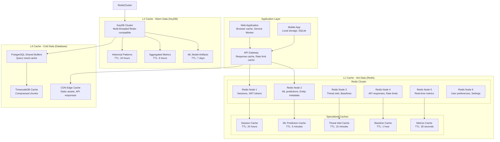

# Caching Strategy & Performance Optimization
## Redis Cluster with Multi-Layer Caching

### Overview
The Nexora platform implements a sophisticated multi-layer caching strategy using Redis Cluster to achieve <100ms response times for ML predictions and support 100K+ events/second throughput. The design includes hot, warm, and cold data tiers with intelligent cache invalidation.

### Multi-Layer Caching Architecture

#### Cache Hierarchy Design


### Redis Cluster Configuration

#### Production Cluster Setup
```yaml
# Redis Cluster Configuration
redis_cluster:
  nodes: 6
  replicas_per_node: 1
  total_slots: 16384
  
  # Memory configuration
  maxmemory: "8gb"
  maxmemory_policy: "allkeys-lru"
  
  # Persistence
  save: "900 1 300 10 60 10000"  # RDB snapshots
  appendonly: "yes"              # AOF logging
  appendfsync: "everysec"        # AOF sync frequency
  
  # Network
  tcp_keepalive: 300
  timeout: 0
  tcp_backlog: 511
  
  # Performance tuning
  hash_max_ziplist_entries: 512
  hash_max_ziplist_value: 64
  list_max_ziplist_size: -2
  set_max_intset_entries: 512
  zset_max_ziplist_entries: 128
  zset_max_ziplist_value: 64
  
  # Security
  requirepass: "${REDIS_PASSWORD}"
  rename_command: 
    - "FLUSHDB": "NEXORA_FLUSHDB_${RANDOM_SUFFIX}"
    - "FLUSHALL": "NEXORA_FLUSHALL_${RANDOM_SUFFIX}"
    - "CONFIG": "NEXORA_CONFIG_${RANDOM_SUFFIX}"

# Cache Policies by Data Type
cache_policies:
  sessions:
    ttl: 86400  # 24 hours
    eviction: "volatile-ttl"
    compression: false
    
  ml_predictions:
    ttl: 300    # 5 minutes
    eviction: "allkeys-lru"
    compression: true
    
  threat_intel:
    ttl: 900    # 15 minutes
    eviction: "volatile-ttl"
    compression: true
    
  entity_baselines:
    ttl: 3600   # 1 hour
    eviction: "allkeys-lru"
    compression: true
    
  api_responses:
    ttl: 60     # 1 minute
    eviction: "allkeys-lru"
    compression: true
    
  real_time_metrics:
    ttl: 30     # 30 seconds
    eviction: "volatile-ttl"
    compression: false
```

### Intelligent Cache Management

#### Cache Service Implementation
```typescript
interface CacheConfig {
  ttl: number;
  compression: boolean;
  evictionPolicy: 'lru' | 'ttl' | 'lfu';
  namespace: string;
}

class IntelligentCacheService {
  private redisCluster: Redis.Cluster;
  private compressionService: CompressionService;
  private metricsCollector: MetricsCollector;
  
  constructor(config: RedisClusterConfig) {
    this.redisCluster = new Redis.Cluster(config.nodes, {
      redisOptions: {
        password: config.password,
        connectTimeout: 1000,
        commandTimeout: 5000,
        retryDelayOnFailover: 100,
        maxRetriesPerRequest: 3
      },
      enableOfflineQueue: false,
      slotsRefreshTimeout: 10000
    });
    
    this.compressionService = new CompressionService();
    this.metricsCollector = new MetricsCollector();
  }
  
  async get<T>(key: string, config: CacheConfig): Promise<T | null> {
    const startTime = Date.now();
    const namespacedKey = `${config.namespace}:${key}`;
    
    try {
      const cached = await this.redisCluster.get(namespacedKey);
      
      if (!cached) {
        this.metricsCollector.recordCacheMiss(config.namespace);
        return null;
      }
      
      this.metricsCollector.recordCacheHit(config.namespace);
      
      // Decompress if needed
      const value = config.compression 
        ? await this.compressionService.decompress(cached)
        : cached;
      
      return JSON.parse(value);
      
    } catch (error) {
      this.metricsCollector.recordCacheError(config.namespace, error);
      return null;
    } finally {
      const duration = Date.now() - startTime;
      this.metricsCollector.recordCacheLatency(config.namespace, duration);
    }
  }
  
  async set<T>(key: string, value: T, config: CacheConfig): Promise<void> {
    const namespacedKey = `${config.namespace}:${key}`;
    let serialized = JSON.stringify(value);
    
    // Compress large values
    if (config.compression && serialized.length > 1024) {
      serialized = await this.compressionService.compress(serialized);
    }
    
    // Set with TTL
    await this.redisCluster.setex(namespacedKey, config.ttl, serialized);
    
    this.metricsCollector.recordCacheWrite(config.namespace, serialized.length);
  }
  
  async invalidate(pattern: string, namespace: string): Promise<number> {
    const keys = await this.redisCluster.keys(`${namespace}:${pattern}`);
    
    if (keys.length === 0) return 0;
    
    // Batch delete for performance
    const pipeline = this.redisCluster.pipeline();
    keys.forEach(key => pipeline.del(key));
    
    await pipeline.exec();
    
    this.metricsCollector.recordCacheInvalidation(namespace, keys.length);
    return keys.length;
  }
  
  async warmup(data: Array<{key: string, value: any}>, config: CacheConfig): Promise<void> {
    const pipeline = this.redisCluster.pipeline();
    
    for (const item of data) {
      const namespacedKey = `${config.namespace}:${item.key}`;
      let serialized = JSON.stringify(item.value);
      
      if (config.compression && serialized.length > 1024) {
        serialized = await this.compressionService.compress(serialized);
      }
      
      pipeline.setex(namespacedKey, config.ttl, serialized);
    }
    
    await pipeline.exec();
    this.metricsCollector.recordCacheWarmup(config.namespace, data.length);
  }
}
```

### ML Prediction Caching

#### Smart Prediction Cache
```typescript
class MLPredictionCache {
  private cacheService: IntelligentCacheService;
  private featureHasher: FeatureHasher;
  
  private readonly PREDICTION_CONFIG: CacheConfig = {
    ttl: 300,  // 5 minutes
    compression: true,
    evictionPolicy: 'lru',
    namespace: 'ml_predictions'
  };
  
  async getPrediction(features: MLFeatures): Promise<MLPrediction | null> {
    // Create deterministic cache key from features
    const featureHash = this.featureHasher.hash(features);
    const cacheKey = `prediction:${featureHash}`;
    
    const cached = await this.cacheService.get<CachedPrediction>(
      cacheKey, 
      this.PREDICTION_CONFIG
    );
    
    if (cached && this.isValidPrediction(cached, features)) {
      return cached.prediction;
    }
    
    return null;
  }
  
  async cachePrediction(
    features: MLFeatures, 
    prediction: MLPrediction
  ): Promise<void> {
    const featureHash = this.featureHasher.hash(features);
    const cacheKey = `prediction:${featureHash}`;
    
    const cachedPrediction: CachedPrediction = {
      prediction,
      features,
      timestamp: Date.now(),
      model_version: prediction.model_version,
      confidence: prediction.confidence
    };
    
    await this.cacheService.set(
      cacheKey, 
      cachedPrediction, 
      this.PREDICTION_CONFIG
    );
  }
  
  private isValidPrediction(
    cached: CachedPrediction, 
    currentFeatures: MLFeatures
  ): boolean {
    // Check if features have changed significantly
    const featureDrift = this.calculateFeatureDrift(
      cached.features, 
      currentFeatures
    );
    
    // Invalidate if drift is too high or confidence is low
    return featureDrift < 0.1 && cached.confidence > 0.8;
  }
  
  async invalidateModelPredictions(modelVersion: string): Promise<void> {
    // Invalidate all predictions for a specific model version
    await this.cacheService.invalidate(
      `prediction:*:${modelVersion}`, 
      'ml_predictions'
    );
  }
}

class FeatureHasher {
  hash(features: MLFeatures): string {
    // Create deterministic hash from feature values
    const sortedFeatures = Object.keys(features)
      .sort()
      .map(key => `${key}:${features[key]}`)
      .join('|');
    
    return crypto
      .createHash('sha256')
      .update(sortedFeatures)
      .digest('hex')
      .substring(0, 16);
  }
}
```

### Cache Invalidation Strategies

#### Event-Driven Invalidation
```typescript
class CacheInvalidationService {
  private cacheService: IntelligentCacheService;
  private eventBus: EventBus;
  
  constructor() {
    this.setupEventHandlers();
  }
  
  private setupEventHandlers(): void {
    // Entity updates invalidate related caches
    this.eventBus.on('entity.updated', async (event: EntityUpdatedEvent) => {
      await Promise.all([
        this.invalidateEntityCache(event.entity_id),
        this.invalidateBaselineCache(event.entity_id),
        this.invalidatePredictionCache(event.entity_id),
        this.invalidateRelationshipCache(event.entity_id)
      ]);
    });
    
    // Threat detection invalidates security caches
    this.eventBus.on('threat.detected', async (event: ThreatDetectedEvent) => {
      await Promise.all([
        this.invalidateThreatIntelCache(event.entity_id),
        this.invalidateRiskScoreCache(event.entity_id),
        this.invalidateMetricsCache(event.tenant_id)
      ]);
    });
    
    // Model updates invalidate ML caches
    this.eventBus.on('model.updated', async (event: ModelUpdatedEvent) => {
      await this.invalidateModelCache(event.model_version);
    });
    
    // Baseline changes invalidate behavioral caches
    this.eventBus.on('baseline.updated', async (event: BaselineUpdatedEvent) => {
      await Promise.all([
        this.invalidateBaselineCache(event.entity_id),
        this.invalidatePredictionCache(event.entity_id),
        this.invalidateAnomalyCache(event.entity_id)
      ]);
    });
  }
  
  private async invalidateEntityCache(entityId: string): Promise<void> {
    await this.cacheService.invalidate(`entity:${entityId}:*`, 'entities');
  }
  
  private async invalidateBaselineCache(entityId: string): Promise<void> {
    await this.cacheService.invalidate(`baseline:${entityId}:*`, 'baselines');
  }
  
  private async invalidatePredictionCache(entityId: string): Promise<void> {
    await this.cacheService.invalidate(`prediction:*:${entityId}`, 'ml_predictions');
  }
  
  private async invalidateModelCache(modelVersion: string): Promise<void> {
    await Promise.all([
      this.cacheService.invalidate(`model:${modelVersion}:*`, 'ml_models'),
      this.cacheService.invalidate(`prediction:*:${modelVersion}`, 'ml_predictions')
    ]);
  }
}
```

### Performance Optimization Strategies

#### Database Query Optimization
```sql
-- Optimized queries with caching hints

-- Entity lookup with cache-friendly structure
CREATE OR REPLACE FUNCTION get_entity_with_cache(
    p_tenant_id UUID,
    p_entity_id UUID
) RETURNS TABLE (
    entity_data JSONB,
    cache_key TEXT,
    cache_ttl INTEGER
) AS $$
BEGIN
    -- Return structured data optimized for caching
    RETURN QUERY
    SELECT 
        jsonb_build_object(
            'id', e.id,
            'name', e.name,
            'type', e.type,
            'provider', e.provider,
            'status', e.status,
            'risk_score', e.risk_score,
            'metadata', e.metadata,
            'last_seen_at', e.last_seen_at,
            'baselines', (
                SELECT jsonb_agg(
                    jsonb_build_object(
                        'type', eb.baseline_type,
                        'data', eb.baseline_data,
                        'confidence', eb.confidence_score
                    )
                )
                FROM entity_baselines eb 
                WHERE eb.entity_id = e.id 
                AND eb.expires_at > NOW()
            )
        ) as entity_data,
        'entity:' || p_entity_id::TEXT as cache_key,
        3600 as cache_ttl  -- 1 hour
    FROM entities e
    WHERE e.tenant_id = p_tenant_id 
    AND e.id = p_entity_id;
END;
$$ LANGUAGE plpgsql;

-- Aggregated metrics with built-in caching
CREATE MATERIALIZED VIEW tenant_metrics_cache AS
SELECT 
    tenant_id,
    date_trunc('hour', time) as hour,
    COUNT(*) as total_events,
    COUNT(*) FILTER (WHERE event_type = 'threat.detected') as threat_count,
    AVG(risk_score) FILTER (WHERE risk_score IS NOT NULL) as avg_risk_score,
    MAX(risk_score) as max_risk_score,
    COUNT(DISTINCT entity_id) as unique_entities
FROM entity_events
WHERE time >= NOW() - INTERVAL '24 hours'
GROUP BY tenant_id, date_trunc('hour', time);

-- Refresh materialized view every 5 minutes
CREATE INDEX CONCURRENTLY idx_tenant_metrics_cache_refresh 
ON tenant_metrics_cache (tenant_id, hour);
```

#### Application-Level Optimizations
```typescript
class PerformanceOptimizer {
  private cacheService: IntelligentCacheService;
  private metricsCollector: MetricsCollector;
  
  // Batch cache operations
  async batchGet<T>(
    keys: string[], 
    config: CacheConfig
  ): Promise<Map<string, T>> {
    const pipeline = this.redisCluster.pipeline();
    const namespacedKeys = keys.map(key => `${config.namespace}:${key}`);
    
    namespacedKeys.forEach(key => pipeline.get(key));
    
    const results = await pipeline.exec();
    const resultMap = new Map<string, T>();
    
    results.forEach((result, index) => {
      if (result[1]) {
        const value = config.compression 
          ? this.compressionService.decompress(result[1])
          : result[1];
        resultMap.set(keys[index], JSON.parse(value));
      }
    });
    
    return resultMap;
  }
  
  // Preemptive cache warming
  async warmupEntityCache(tenantId: string): Promise<void> {
    const recentEntities = await this.getRecentEntities(tenantId, 100);
    
    const warmupData = recentEntities.map(entity => ({
      key: `entity:${entity.id}`,
      value: entity
    }));
    
    await this.cacheService.warmup(warmupData, {
      ttl: 3600,
      compression: true,
      evictionPolicy: 'lru',
      namespace: 'entities'
    });
  }
  
  // Cache-aside pattern with fallback
  async getWithFallback<T>(
    key: string,
    config: CacheConfig,
    fallbackFn: () => Promise<T>
  ): Promise<T> {
    // Try cache first
    let result = await this.cacheService.get<T>(key, config);
    
    if (result === null) {
      // Cache miss - fetch from source
      result = await fallbackFn();
      
      // Cache the result asynchronously
      setImmediate(() => {
        this.cacheService.set(key, result, config);
      });
    }
    
    return result;
  }
  
  // Adaptive TTL based on access patterns
  calculateAdaptiveTTL(
    key: string, 
    accessFrequency: number, 
    baseTTL: number
  ): number {
    // Increase TTL for frequently accessed items
    const frequencyMultiplier = Math.min(accessFrequency / 10, 3);
    return Math.floor(baseTTL * frequencyMultiplier);
  }
}
```

### Monitoring and Metrics

#### Cache Performance Monitoring
```yaml
# Redis metrics for monitoring
redis_metrics:
  # Memory usage
  - redis_memory_used_bytes
  - redis_memory_max_bytes
  - redis_memory_fragmentation_ratio
  
  # Performance
  - redis_commands_processed_total
  - redis_commands_duration_seconds
  - redis_keyspace_hits_total
  - redis_keyspace_misses_total
  
  # Cluster health
  - redis_cluster_nodes
  - redis_cluster_slots_assigned
  - redis_cluster_slots_ok
  - redis_cluster_state
  
  # Cache-specific metrics
  - nexora_cache_hit_rate
  - nexora_cache_miss_rate
  - nexora_cache_evictions_total
  - nexora_cache_memory_usage_bytes

# Performance targets
performance_targets:
  cache_hit_rate: "> 95%"
  cache_latency_p99: "< 5ms"
  cache_memory_usage: "< 80%"
  eviction_rate: "< 1%"
  
# Alerting rules
cache_alerts:
  - alert: CacheHitRateLow
    expr: nexora_cache_hit_rate < 0.90
    for: 5m
    labels:
      severity: warning
    annotations:
      summary: "Cache hit rate below 90%"
      
  - alert: CacheLatencyHigh
    expr: histogram_quantile(0.99, nexora_cache_latency_seconds) > 0.010
    for: 2m
    labels:
      severity: warning
    annotations:
      summary: "Cache P99 latency above 10ms"
      
  - alert: CacheMemoryHigh
    expr: redis_memory_used_bytes / redis_memory_max_bytes > 0.85
    for: 5m
    labels:
      severity: critical
    annotations:
      summary: "Redis memory usage above 85%"
```
