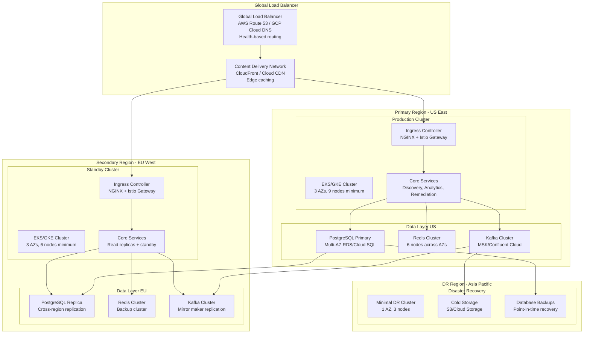

# Deployment Architecture & Disaster Recovery
## Multi-Region Kubernetes with 99.99% Uptime SLA

### Overview
The Nexora platform deploys on Kubernetes across multiple regions with automated failover, zero-downtime deployments, and comprehensive disaster recovery capabilities. The architecture supports global scale with regional data sovereignty and sub-second failover times.

### Multi-Region Deployment Architecture

#### Global Infrastructure Layout


### Kubernetes Cluster Configuration

#### Production Cluster Specification
```yaml
# EKS Cluster Configuration (Terraform)
resource "aws_eks_cluster" "nexora_production" {
  name     = "nexora-prod-${var.region}"
  role_arn = aws_iam_role.eks_cluster_role.arn
  version  = "1.28"
  
  vpc_config {
    subnet_ids              = var.private_subnet_ids
    endpoint_private_access = true
    endpoint_public_access  = true
    public_access_cidrs     = ["0.0.0.0/0"]
    security_group_ids      = [aws_security_group.eks_cluster.id]
  }
  
  encryption_config {
    provider {
      key_arn = aws_kms_key.eks_encryption.arn
    }
    resources = ["secrets"]
  }
  
  enabled_cluster_log_types = [
    "api", "audit", "authenticator", "controllerManager", "scheduler"
  ]
  
  depends_on = [
    aws_iam_role_policy_attachment.eks_cluster_policy,
    aws_iam_role_policy_attachment.eks_vpc_resource_controller,
  ]
  
  tags = {
    Environment = "production"
    Project     = "nexora"
    Region      = var.region
  }
}

# Node Groups Configuration
resource "aws_eks_node_group" "nexora_platform" {
  cluster_name    = aws_eks_cluster.nexora_production.name
  node_group_name = "platform-nodes"
  node_role_arn   = aws_iam_role.eks_node_role.arn
  subnet_ids      = var.private_subnet_ids
  
  instance_types = ["m6i.2xlarge", "m6i.4xlarge"]
  capacity_type  = "ON_DEMAND"
  
  scaling_config {
    desired_size = 9
    max_size     = 30
    min_size     = 9
  }
  
  update_config {
    max_unavailable_percentage = 25
  }
  
  # Taints for platform services
  taint {
    key    = "platform"
    value  = "true"
    effect = "NO_SCHEDULE"
  }
  
  labels = {
    "node-type" = "platform"
    "workload"  = "compute-intensive"
  }
}

resource "aws_eks_node_group" "nexora_data" {
  cluster_name    = aws_eks_cluster.nexora_production.name
  node_group_name = "data-nodes"
  node_role_arn   = aws_iam_role.eks_node_role.arn
  subnet_ids      = var.private_subnet_ids
  
  instance_types = ["r6i.2xlarge", "r6i.4xlarge"]  # Memory-optimized
  capacity_type  = "ON_DEMAND"
  
  scaling_config {
    desired_size = 6
    max_size     = 20
    min_size     = 6
  }
  
  # Taints for data services
  taint {
    key    = "data"
    value  = "true"
    effect = "NO_SCHEDULE"
  }
  
  labels = {
    "node-type" = "data"
    "workload"  = "memory-intensive"
  }
}

# Spot instances for non-critical workloads
resource "aws_eks_node_group" "nexora_spot" {
  cluster_name    = aws_eks_cluster.nexora_production.name
  node_group_name = "spot-nodes"
  node_role_arn   = aws_iam_role.eks_node_role.arn
  subnet_ids      = var.private_subnet_ids
  
  instance_types = ["m6i.large", "m6i.xlarge", "m5.large", "m5.xlarge"]
  capacity_type  = "SPOT"
  
  scaling_config {
    desired_size = 3
    max_size     = 15
    min_size     = 0
  }
  
  labels = {
    "node-type" = "spot"
    "workload"  = "batch-processing"
  }
}
```

#### Kubernetes Manifests Structure
```yaml
# Namespace Configuration
apiVersion: v1
kind: Namespace
metadata:
  name: platform
  labels:
    name: platform
    istio-injection: enabled
    pod-security.kubernetes.io/enforce: restricted
    pod-security.kubernetes.io/audit: restricted
    pod-security.kubernetes.io/warn: restricted

---
apiVersion: v1
kind: Namespace
metadata:
  name: data
  labels:
    name: data
    istio-injection: enabled

---
apiVersion: v1
kind: Namespace
metadata:
  name: monitoring
  labels:
    name: monitoring
    istio-injection: disabled

---
# Discovery Service Deployment
apiVersion: apps/v1
kind: Deployment
metadata:
  name: discovery-service
  namespace: platform
  labels:
    app: discovery-service
    version: v1.0.0
spec:
  replicas: 3
  strategy:
    type: RollingUpdate
    rollingUpdate:
      maxSurge: 1
      maxUnavailable: 0
  selector:
    matchLabels:
      app: discovery-service
  template:
    metadata:
      labels:
        app: discovery-service
        version: v1.0.0
      annotations:
        prometheus.io/scrape: "true"
        prometheus.io/port: "8080"
        prometheus.io/path: "/metrics"
    spec:
      serviceAccountName: discovery-service
      securityContext:
        runAsNonRoot: true
        runAsUser: 1000
        fsGroup: 2000
      tolerations:
      - key: "platform"
        operator: "Equal"
        value: "true"
        effect: "NoSchedule"
      nodeSelector:
        node-type: platform
      containers:
      - name: discovery-service
        image: nexora/discovery-service:v1.0.0
        imagePullPolicy: Always
        ports:
        - containerPort: 8080
          name: http
        - containerPort: 9090
          name: grpc
        - containerPort: 8081
          name: metrics
        env:
        - name: PORT
          value: "8080"
        - name: GRPC_PORT
          value: "9090"
        - name: DATABASE_URL
          valueFrom:
            secretKeyRef:
              name: database-credentials
              key: url
        - name: REDIS_URL
          valueFrom:
            secretKeyRef:
              name: redis-credentials
              key: url
        - name: KAFKA_BROKERS
          valueFrom:
            configMapKeyRef:
              name: kafka-config
              key: brokers
        - name: SPIFFE_ENDPOINT_SOCKET
          value: "unix:///run/spire/sockets/agent.sock"
        resources:
          requests:
            memory: "512Mi"
            cpu: "250m"
          limits:
            memory: "2Gi"
            cpu: "1000m"
        livenessProbe:
          httpGet:
            path: /health
            port: 8080
          initialDelaySeconds: 30
          periodSeconds: 10
          timeoutSeconds: 5
          failureThreshold: 3
        readinessProbe:
          httpGet:
            path: /ready
            port: 8080
          initialDelaySeconds: 5
          periodSeconds: 5
          timeoutSeconds: 3
          failureThreshold: 3
        volumeMounts:
        - name: spire-agent-socket
          mountPath: /run/spire/sockets
          readOnly: true
        - name: config
          mountPath: /app/config
          readOnly: true
      volumes:
      - name: spire-agent-socket
        hostPath:
          path: /run/spire/sockets
          type: Directory
      - name: config
        configMap:
          name: discovery-service-config
```

### Auto-Scaling Configuration

#### Horizontal Pod Autoscaler (HPA)
```yaml
# HPA for Discovery Service
apiVersion: autoscaling/v2
kind: HorizontalPodAutoscaler
metadata:
  name: discovery-service-hpa
  namespace: platform
spec:
  scaleTargetRef:
    apiVersion: apps/v1
    kind: Deployment
    name: discovery-service
  minReplicas: 3
  maxReplicas: 20
  metrics:
  - type: Resource
    resource:
      name: cpu
      target:
        type: Utilization
        averageUtilization: 70
  - type: Resource
    resource:
      name: memory
      target:
        type: Utilization
        averageUtilization: 80
  - type: Pods
    pods:
      metric:
        name: http_requests_per_second
      target:
        type: AverageValue
        averageValue: "100"
  behavior:
    scaleUp:
      stabilizationWindowSeconds: 60
      policies:
      - type: Percent
        value: 100
        periodSeconds: 15
      - type: Pods
        value: 4
        periodSeconds: 15
      selectPolicy: Max
    scaleDown:
      stabilizationWindowSeconds: 300
      policies:
      - type: Percent
        value: 10
        periodSeconds: 60

---
# Vertical Pod Autoscaler (VPA)
apiVersion: autoscaling.k8s.io/v1
kind: VerticalPodAutoscaler
metadata:
  name: discovery-service-vpa
  namespace: platform
spec:
  targetRef:
    apiVersion: apps/v1
    kind: Deployment
    name: discovery-service
  updatePolicy:
    updateMode: "Auto"
  resourcePolicy:
    containerPolicies:
    - containerName: discovery-service
      maxAllowed:
        cpu: 2
        memory: 4Gi
      minAllowed:
        cpu: 100m
        memory: 256Mi
```

#### Cluster Autoscaler Configuration
```yaml
# Cluster Autoscaler
apiVersion: apps/v1
kind: Deployment
metadata:
  name: cluster-autoscaler
  namespace: kube-system
  labels:
    app: cluster-autoscaler
spec:
  selector:
    matchLabels:
      app: cluster-autoscaler
  template:
    metadata:
      labels:
        app: cluster-autoscaler
    spec:
      serviceAccountName: cluster-autoscaler
      containers:
      - image: k8s.gcr.io/autoscaling/cluster-autoscaler:v1.28.0
        name: cluster-autoscaler
        resources:
          limits:
            cpu: 100m
            memory: 300Mi
          requests:
            cpu: 100m
            memory: 300Mi
        command:
        - ./cluster-autoscaler
        - --v=4
        - --stderrthreshold=info
        - --cloud-provider=aws
        - --skip-nodes-with-local-storage=false
        - --expander=least-waste
        - --node-group-auto-discovery=asg:tag=k8s.io/cluster-autoscaler/enabled,k8s.io/cluster-autoscaler/nexora-prod
        - --balance-similar-node-groups
        - --skip-nodes-with-system-pods=false
        - --scale-down-delay-after-add=10m
        - --scale-down-unneeded-time=10m
        - --scale-down-utilization-threshold=0.5
        env:
        - name: AWS_REGION
          value: us-east-1
```

### Zero-Downtime Deployment Strategy

#### Blue-Green Deployment with Argo Rollouts
```yaml
apiVersion: argoproj.io/v1alpha1
kind: Rollout
metadata:
  name: discovery-service-rollout
  namespace: platform
spec:
  replicas: 6
  strategy:
    blueGreen:
      # Active service points to blue version
      activeService: discovery-service-active
      # Preview service points to green version during deployment
      previewService: discovery-service-preview
      # Automatic promotion after successful checks
      autoPromotionEnabled: false
      # Time to wait before automatic promotion
      scaleDownDelaySeconds: 30
      # Time to keep old version after promotion
      prePromotionAnalysis:
        templates:
        - templateName: success-rate
        args:
        - name: service-name
          value: discovery-service-preview
      postPromotionAnalysis:
        templates:
        - templateName: success-rate
        args:
        - name: service-name
          value: discovery-service-active
  selector:
    matchLabels:
      app: discovery-service
  template:
    metadata:
      labels:
        app: discovery-service
    spec:
      containers:
      - name: discovery-service
        image: nexora/discovery-service:v1.0.0
        ports:
        - containerPort: 8080
        resources:
          requests:
            memory: "512Mi"
            cpu: "250m"
          limits:
            memory: "2Gi"
            cpu: "1000m"

---
# Analysis Template for Success Rate
apiVersion: argoproj.io/v1alpha1
kind: AnalysisTemplate
metadata:
  name: success-rate
  namespace: platform
spec:
  args:
  - name: service-name
  metrics:
  - name: success-rate
    interval: 30s
    count: 5
    successCondition: result[0] >= 0.95
    failureLimit: 3
    provider:
      prometheus:
        address: http://prometheus.monitoring.svc.cluster.local:9090
        query: |
          sum(rate(http_requests_total{service="{{args.service-name}}",code!~"5.."}[5m])) /
          sum(rate(http_requests_total{service="{{args.service-name}}"}[5m]))
```

### Disaster Recovery Strategy

#### Multi-Region Failover Configuration
```yaml
# Global Load Balancer Health Checks (Terraform)
resource "aws_route53_health_check" "primary_region" {
  fqdn                            = "api-us-east.nexora.com"
  port                            = 443
  type                            = "HTTPS"
  resource_path                   = "/health"
  failure_threshold               = 3
  request_interval                = 30
  cloudwatch_alarm_region         = "us-east-1"
  cloudwatch_alarm_name           = "nexora-primary-health"
  insufficient_data_health_status = "Failure"
  
  tags = {
    Name = "Nexora Primary Region Health Check"
  }
}

resource "aws_route53_health_check" "secondary_region" {
  fqdn                            = "api-eu-west.nexora.com"
  port                            = 443
  type                            = "HTTPS"
  resource_path                   = "/health"
  failure_threshold               = 3
  request_interval                = 30
  cloudwatch_alarm_region         = "eu-west-1"
  cloudwatch_alarm_name           = "nexora-secondary-health"
  insufficient_data_health_status = "Failure"
  
  tags = {
    Name = "Nexora Secondary Region Health Check"
  }
}

# DNS Failover Configuration
resource "aws_route53_record" "primary" {
  zone_id = aws_route53_zone.nexora.zone_id
  name    = "api.nexora.com"
  type    = "A"
  
  set_identifier = "primary"
  health_check_id = aws_route53_health_check.primary_region.id
  
  failover_routing_policy {
    type = "PRIMARY"
  }
  
  alias {
    name                   = aws_lb.primary_alb.dns_name
    zone_id                = aws_lb.primary_alb.zone_id
    evaluate_target_health = true
  }
}

resource "aws_route53_record" "secondary" {
  zone_id = aws_route53_zone.nexora.zone_id
  name    = "api.nexora.com"
  type    = "A"
  
  set_identifier = "secondary"
  health_check_id = aws_route53_health_check.secondary_region.id
  
  failover_routing_policy {
    type = "SECONDARY"
  }
  
  alias {
    name                   = aws_lb.secondary_alb.dns_name
    zone_id                = aws_lb.secondary_alb.zone_id
    evaluate_target_health = true
  }
}
```

#### Database Disaster Recovery
```yaml
# PostgreSQL Cross-Region Replication
apiVersion: postgresql.cnpg.io/v1
kind: Cluster
metadata:
  name: postgres-primary
  namespace: data
spec:
  instances: 3
  primaryUpdateStrategy: unsupervised
  
  postgresql:
    parameters:
      max_connections: "200"
      shared_buffers: "256MB"
      effective_cache_size: "1GB"
      wal_level: "replica"
      max_wal_senders: "10"
      max_replication_slots: "10"
      hot_standby: "on"
  
  bootstrap:
    initdb:
      database: nexora
      owner: nexora
      secret:
        name: postgres-credentials
  
  backup:
    retentionPolicy: "30d"
    barmanObjectStore:
      destinationPath: "s3://nexora-postgres-backup"
      s3Credentials:
        accessKeyId:
          name: backup-credentials
          key: ACCESS_KEY_ID
        secretAccessKey:
          name: backup-credentials
          key: SECRET_ACCESS_KEY
      wal:
        retention: "7d"
      data:
        retention: "30d"
  
  monitoring:
    enabled: true
    
---
# Cross-Region Replica
apiVersion: postgresql.cnpg.io/v1
kind: Cluster
metadata:
  name: postgres-replica
  namespace: data
spec:
  instances: 2
  
  bootstrap:
    pg_basebackup:
      source: postgres-primary
  
  externalClusters:
  - name: postgres-primary
    connectionParameters:
      host: postgres-primary-rw.data.svc.cluster.local
      user: streaming_replica
      dbname: postgres
    password:
      name: postgres-replica-credentials
      key: password
```

### Monitoring & Observability

#### Prometheus Configuration
```yaml
# Prometheus Server Configuration
apiVersion: v1
kind: ConfigMap
metadata:
  name: prometheus-config
  namespace: monitoring
data:
  prometheus.yml: |
    global:
      scrape_interval: 15s
      evaluation_interval: 15s
      external_labels:
        cluster: nexora-prod
        region: us-east-1
    
    rule_files:
    - "/etc/prometheus/rules/*.yml"
    
    alerting:
      alertmanagers:
      - static_configs:
        - targets:
          - alertmanager.monitoring.svc.cluster.local:9093
    
    scrape_configs:
    # Kubernetes API Server
    - job_name: 'kubernetes-apiservers'
      kubernetes_sd_configs:
      - role: endpoints
      scheme: https
      tls_config:
        ca_file: /var/run/secrets/kubernetes.io/serviceaccount/ca.crt
      bearer_token_file: /var/run/secrets/kubernetes.io/serviceaccount/token
      relabel_configs:
      - source_labels: [__meta_kubernetes_namespace, __meta_kubernetes_service_name, __meta_kubernetes_endpoint_port_name]
        action: keep
        regex: default;kubernetes;https
    
    # Platform Services
    - job_name: 'nexora-platform'
      kubernetes_sd_configs:
      - role: pod
        namespaces:
          names:
          - platform
      relabel_configs:
      - source_labels: [__meta_kubernetes_pod_annotation_prometheus_io_scrape]
        action: keep
        regex: true
      - source_labels: [__meta_kubernetes_pod_annotation_prometheus_io_path]
        action: replace
        target_label: __metrics_path__
        regex: (.+)
      - source_labels: [__address__, __meta_kubernetes_pod_annotation_prometheus_io_port]
        action: replace
        regex: ([^:]+)(?::\d+)?;(\d+)
        replacement: $1:$2
        target_label: __address__
    
    # Node Exporter
    - job_name: 'node-exporter'
      kubernetes_sd_configs:
      - role: node
      relabel_configs:
      - action: labelmap
        regex: __meta_kubernetes_node_label_(.+)
      - target_label: __address__
        replacement: kubernetes.default.svc:443
      - source_labels: [__meta_kubernetes_node_name]
        regex: (.+)
        target_label: __metrics_path__
        replacement: /api/v1/nodes/${1}/proxy/metrics

    # Remote Write for Cross-Region
    remote_write:
    - url: "https://prometheus-eu-west.nexora.com/api/v1/write"
      basic_auth:
        username: "nexora"
        password_file: "/etc/prometheus/secrets/remote-write-password"
```

#### SLA Monitoring & Alerting
```yaml
# SLA Alerting Rules
apiVersion: v1
kind: ConfigMap
metadata:
  name: prometheus-sla-rules
  namespace: monitoring
data:
  sla.yml: |
    groups:
    - name: sla.rules
      rules:
      # API Availability SLA (99.99% uptime)
      - alert: APIAvailabilitySLABreach
        expr: |
          (
            sum(rate(http_requests_total{code!~"5.."}[5m])) /
            sum(rate(http_requests_total[5m]))
          ) < 0.9999
        for: 1m
        labels:
          severity: critical
          sla: availability
        annotations:
          summary: "API availability below 99.99% SLA"
          description: "API availability is {{ $value | humanizePercentage }} for the last 5 minutes"
      
      # Response Time SLA (P99 < 1000ms)
      - alert: ResponseTimeSLABreach
        expr: |
          histogram_quantile(0.99, 
            sum(rate(http_request_duration_seconds_bucket[5m])) by (le)
          ) > 1.0
        for: 2m
        labels:
          severity: warning
          sla: latency
        annotations:
          summary: "API P99 response time above 1000ms SLA"
          description: "P99 response time is {{ $value }}s for the last 5 minutes"
      
      # Error Rate SLA (< 0.1%)
      - alert: ErrorRateSLABreach
        expr: |
          (
            sum(rate(http_requests_total{code=~"5.."}[5m])) /
            sum(rate(http_requests_total[5m]))
          ) > 0.001
        for: 1m
        labels:
          severity: critical
          sla: error_rate
        annotations:
          summary: "Error rate above 0.1% SLA"
          description: "Error rate is {{ $value | humanizePercentage }} for the last 5 minutes"
```

### Cost Optimization

#### Resource Optimization Strategy
```yaml
# Pod Disruption Budget
apiVersion: policy/v1
kind: PodDisruptionBudget
metadata:
  name: discovery-service-pdb
  namespace: platform
spec:
  minAvailable: 2
  selector:
    matchLabels:
      app: discovery-service

---
# Resource Quotas per Namespace
apiVersion: v1
kind: ResourceQuota
metadata:
  name: platform-quota
  namespace: platform
spec:
  hard:
    requests.cpu: "20"
    requests.memory: 40Gi
    limits.cpu: "40"
    limits.memory: 80Gi
    persistentvolumeclaims: "10"
    pods: "50"
    services: "20"

---
# Limit Ranges
apiVersion: v1
kind: LimitRange
metadata:
  name: platform-limits
  namespace: platform
spec:
  limits:
  - default:
      cpu: "500m"
      memory: "1Gi"
    defaultRequest:
      cpu: "100m"
      memory: "256Mi"
    type: Container
  - max:
      cpu: "4"
      memory: "8Gi"
    min:
      cpu: "50m"
      memory: "128Mi"
    type: Container
```

### Backup & Recovery Procedures

#### Automated Backup Strategy
```bash
#!/bin/bash
# Automated backup script

# Database backup
kubectl exec -n data postgres-primary-1 -- pg_dump \
  -h localhost -U nexora -d nexora \
  --no-password --clean --if-exists \
  | gzip > /backups/postgres-$(date +%Y%m%d-%H%M%S).sql.gz

# Kafka topic backup
kubectl exec -n messaging kafka-0 -- kafka-console-consumer \
  --bootstrap-server localhost:9092 \
  --topic audit.events \
  --from-beginning \
  --timeout-ms 30000 > /backups/kafka-audit-$(date +%Y%m%d).json

# Kubernetes manifests backup
kubectl get all,configmaps,secrets,pv,pvc \
  --all-namespaces -o yaml > /backups/k8s-manifests-$(date +%Y%m%d).yaml

# Upload to S3
aws s3 sync /backups/ s3://nexora-disaster-recovery/backups/

# Retention cleanup (keep 30 days)
find /backups/ -type f -mtime +30 -delete
```

This deployment architecture provides enterprise-grade reliability, scalability, and disaster recovery capabilities while maintaining cost efficiency and operational simplicity.
